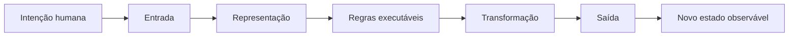
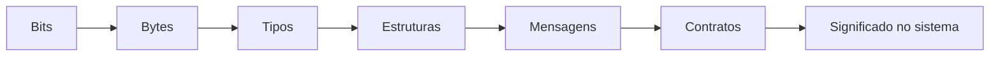
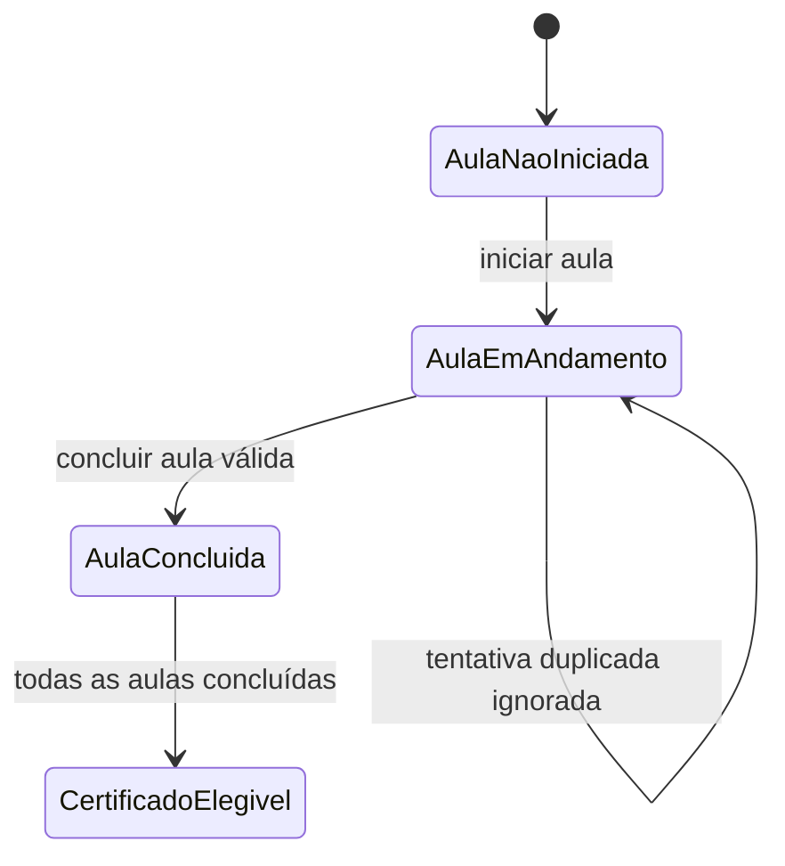
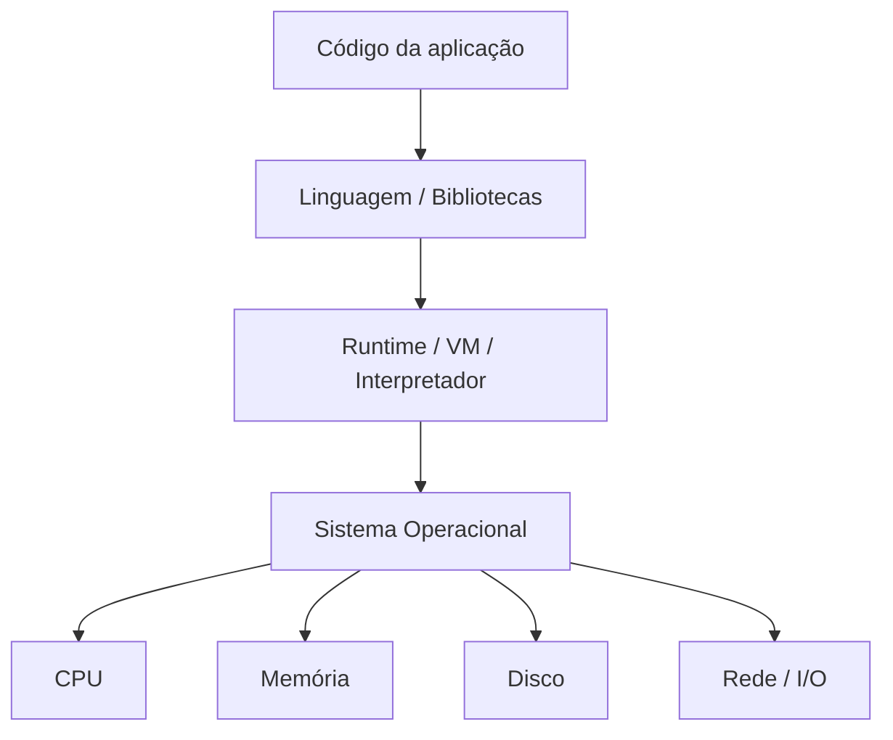
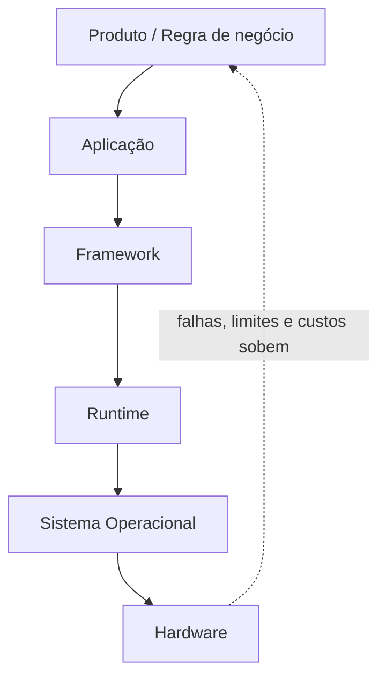
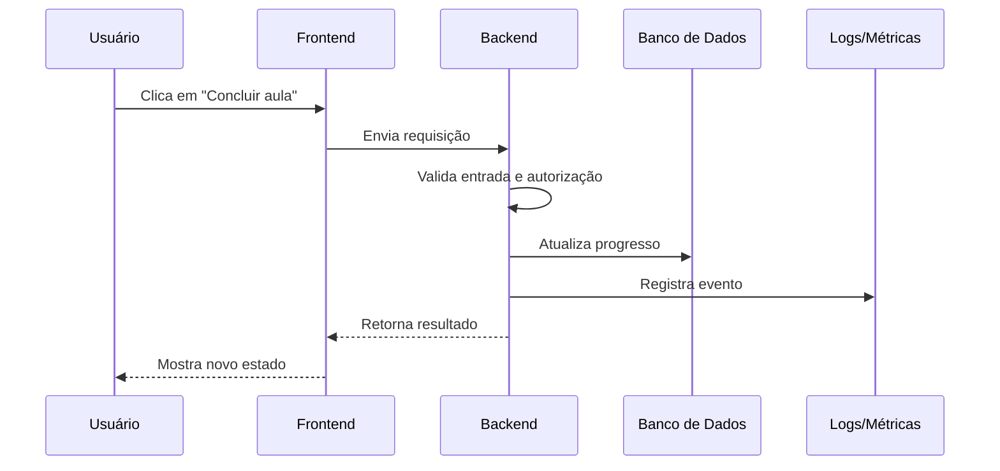
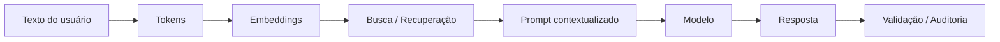
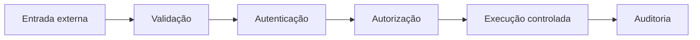

# 01. O que é computação

## Status editorial

- **Estado final:** aprovado após reestruturação editorial profunda, com progressão do básico ao especialista, exemplos simples e profissionais, aplicação em sistema real, segurança, performance, testes, observabilidade, limitações, trade-offs, exercícios, desafio prático e conexão com o projeto final.
- **Livro:** Fundamentos de Computação e Engenharia de Software.
- **Capítulo:** 01 — O que é computação.
- **Escopo:** computação como representação de informação, transformação formal de estado, execução por máquina, abstrações, correção, limites e consequências profissionais em Full Stack, IA e Cybersegurança.
- **Esteira editorial declarada:** editorial-director → curriculum-architect → chapter-writer → technical-reviewer → depth-auditor → code-example-reviewer → site-integrator → final-quality-gate.

## Abertura do capítulo

Antes de aprender uma linguagem de programação, construir uma API, treinar um modelo de IA ou proteger um sistema contra ataques, é necessário entender o que está sendo automatizado. Computação não é apenas “usar computador”. Também não é apenas “programar”. Programação é uma forma de expressar computação; computadores são máquinas que executam computação; sistemas digitais são ambientes onde muitas computações interagem. A ideia central é mais profunda: representar alguma parte do mundo, aplicar regras sobre essa representação e produzir uma saída, uma decisão ou uma mudança de estado.

Quando um estudante clica em **Concluir aula**, uma intenção humana atravessa várias camadas: interface, navegador, rede, API, autenticação, autorização, banco de dados, logs, métricas e talvez sistemas de IA. Em cada camada, algo precisa ser representado: quem é o estudante, qual aula foi concluída, qual curso está ativo, qual matrícula permite a ação, qual regra define progresso, qual evento precisa ser auditado e qual resposta deve ser mostrada. O clique não é computação por si só; a computação começa quando essa intenção é codificada, validada, transformada e registrada.

Este capítulo estabelece o modelo mental que sustentará todo o livro: **computação é representação + regra + transformação + estado, operando sob limites**. Esses limites podem ser físicos, como CPU, memória, disco, rede e energia; lógicos, como tipos, contratos, algoritmos, invariantes e complexidade; ou operacionais, como latência, custo, falhas, ataques, auditoria e manutenção. Entender esses limites desde o início evita uma visão ingênua em que software parece apenas uma coleção de telas e funções. Software profissional é comportamento executável com consequências.

A partir daqui, você aprenderá a olhar para qualquer sistema — uma aplicação Full Stack, um pipeline de IA, uma API bancária, um mecanismo de autenticação ou uma plataforma de cursos — e perguntar: quais dados entram, como são representados, quais regras os transformam, quais estados são válidos, quais invariantes não podem ser quebrados, quais custos existem, quais erros podem ocorrer e quais evidências ficarão disponíveis quando algo falhar.

## Mapa do capítulo

A leitura seguirá uma progressão planejada:

1. Intuição inicial: intenção humana, representação e execução mecânica.
2. Definição técnica de computação.
3. Representação de informação: dado, informação, tipos, contratos e semântica.
4. Transformação por regras e mudança de estado.
5. Execução por máquina: hardware, sistema operacional, runtime e aplicação.
6. Abstrações: produtividade, vazamentos e custos escondidos.
7. Correção, confiabilidade e limites computacionais.
8. Aplicações em sistemas reais.
9. Conexão com Full Stack, IA e Cybersegurança.
10. Exercícios, desafio prático e consolidação.

## 1. Objetivos de aprendizagem

## Objetivos

### Ao nível básico, você deve conseguir:

- explicar computação como transformação de representações por regras;
- diferenciar dado, informação, instrução, algoritmo, programa, processo e sistema;
- entender o ciclo entrada → processamento → saída;
- reconhecer que bits precisam de contexto para ter significado útil;
- descrever, em linguagem simples, como uma intenção humana vira uma ação executada por software.

### Ao nível profissional, você deve conseguir:

- explicar representação, contratos, tipos, esquemas, estados e invariantes;
- entender como software transforma intenção humana em comportamento executável;
- reconhecer riscos de validação, ambiguidade, precisão numérica, segurança e performance;
- avaliar uma operação real considerando entrada, autorização, regra de negócio, persistência, eventos, logs e resposta;
- separar o que é regra de domínio, detalhe de infraestrutura e evidência operacional.

### Ao nível especialista, você deve conseguir:

- enxergar computação como transformação formal de estado;
- relacionar abstrações a custos, vazamentos e falhas de diagnóstico;
- entender correção, limites computacionais, confiabilidade e observabilidade;
- conectar fundamentos de computação a arquitetura, IA, Cybersegurança, sistemas distribuídos e engenharia de software;
- tomar decisões técnicas explicitando trade-offs, riscos e consequências de longo prazo.

## Pré-requisitos

Este é o primeiro capítulo do livro e não exige experiência anterior de programação. Você precisará apenas de curiosidade técnica, atenção a detalhes e disposição para separar três coisas que iniciantes costumam misturar: intenção humana, representação computacional e execução mecânica. Os trechos de código e pseudocódigo aparecem como instrumentos de raciocínio; não é necessário decorar sintaxe.

## 2. A intuição fundamental

## Intuição

Humanos trabalham com intenção e significado. Dizemos “concluir uma aula”, “pagar um boleto”, “bloquear um usuário” ou “responder uma pergunta”. Essas expressões carregam contexto social, objetivo, expectativa e consequência. Computadores, por outro lado, trabalham com representações e regras. Eles não recebem diretamente a experiência humana de “concluir”, “pagar”, “bloquear” ou “responder”; recebem sequências de bits interpretadas por contratos técnicos.

Software é a ponte entre esses dois mundos. Ele traduz intenções em entradas, entradas em representações, representações em regras executáveis, regras em transformações, transformações em saídas e saídas em novos estados observáveis. Muitos bugs nascem porque a intenção esperada por pessoas não coincide com a representação aceita pelo sistema ou com a execução realmente implementada.



Cada etapa merece atenção profissional:

- **Intenção humana:** é o objetivo no domínio. “O estudante terminou a aula” parece simples, mas pode significar assistir 90% do vídeo, passar em uma avaliação, confirmar presença ou completar uma atividade.
- **Entrada:** é o que atravessa a fronteira do sistema: clique, requisição HTTP, arquivo, evento de fila, resposta de IA, sensor ou job agendado. Entrada externa não deve ser tratada como verdade.
- **Representação:** é a forma computável da entrada: JSON, número inteiro, texto, UUID, timestamp, enum, token, vetor numérico ou registro em banco.
- **Regras executáveis:** são condições e procedimentos descritos com precisão suficiente para uma máquina executar: validar formato, verificar matrícula, calcular progresso, impedir duplicidade.
- **Transformação:** é a aplicação das regras sobre o estado atual e a entrada. Pode gerar uma consulta, cálculo, atualização, decisão, classificação ou rejeição.
- **Saída:** é o resultado retornado ou emitido: resposta para usuário, evento de domínio, log, métrica, arquivo, alerta ou mudança visual.
- **Novo estado observável:** é a condição do sistema depois da transformação: progresso atualizado, certificado elegível, tentativa negada, erro auditável ou métrica incrementada.

Essa cadeia ajuda a pensar antes de codar. Se uma etapa é vaga, o sistema dependerá de suposições. Se duas camadas interpretam a mesma representação de formas diferentes, surgem bugs. Se uma entrada é aceita como instrução, surgem ataques. Se uma transformação muda estado sem evidência, a equipe não consegue investigar incidentes.

## 3. A definição técnica de computação

## Conceito principal

**Computação é a transformação sistemática de representações de informação por meio de regras executáveis, produzindo saídas, decisões ou mudanças de estado dentro de limites físicos, lógicos e operacionais.**

Essa definição é densa porque precisa servir do primeiro programa ao sistema distribuído em produção. Vamos decompor cada termo.

| Termo | Sentido técnico | Consequência profissional |
| --- | --- | --- |
| Transformação | Alterar, derivar, classificar, validar, consultar ou produzir algo a partir de entrada e estado. | É preciso saber o que muda, o que permanece e quais efeitos colaterais existem. |
| Representação | Forma codificada manipulável pela máquina. | O mesmo valor pode ter significados diferentes; contratos são indispensáveis. |
| Informação | Dado interpretado em contexto. | Sem contexto, o sistema pode tomar decisão correta sobre o dado errado. |
| Regra executável | Procedimento preciso o suficiente para execução mecânica. | Ambiguidade humana precisa virar condição, algoritmo, política ou erro. |
| Saída | Resultado observável da transformação. | Saídas precisam preservar unidade, significado, segurança e contrato. |
| Estado | Conjunto de informações relevantes em determinado momento. | Sistemas precisam controlar transições válidas e impedir estados impossíveis. |
| Limite físico | Restrições de CPU, memória, armazenamento, rede, energia e hardware. | Performance e custo não são detalhes finais; condicionam a solução. |
| Limite lógico | Restrições de algoritmo, tipo, precisão, contrato, complexidade e computabilidade. | Algumas soluções são incorretas, imprecisas ou inviáveis por desenho. |
| Limite operacional | Restrições de latência, disponibilidade, segurança, auditoria, equipe e manutenção. | Um sistema que funciona no laboratório pode falhar em produção. |

> **Ideia-chave:**
> Computadores não manipulam significado diretamente. Eles manipulam representações. O significado depende dos contratos criados por pessoas, linguagens, protocolos, bancos de dados, interfaces e regras de negócio.

Essa definição também explica por que computação é anterior à escolha de tecnologia. Você pode implementar uma regra em JavaScript, Java, Python, SQL, Rust, Go ou em uma planilha; a pergunta fundamental continua sendo a mesma: qual representação está entrando, qual regra está sendo aplicada, qual estado pode mudar e quais limites podem ser atingidos?

## Contexto

Computação aparece em praticamente todos os sistemas contemporâneos: bancos, hospitais, telecomunicações, redes sociais, veículos, sensores industriais, assistentes de IA, sistemas de autenticação, pipelines de dados, plataformas educacionais e ferramentas de desenvolvimento. Em todos esses cenários, a máquina recebe entradas, interpreta representações, aplica regras e produz efeitos.

A diferença entre um script simples e uma plataforma crítica não está no princípio, mas na escala de consequências. Um erro de representação em uma calculadora pessoal pode ser corrigido manualmente. Um erro de representação em cobrança, prontuário, autorização ou IA aplicada pode gerar prejuízo, discriminação, indisponibilidade, vazamento ou decisão incorreta. Por isso, este livro trata computação como base de responsabilidade profissional.

## Problema real

Imagine uma plataforma de cursos online. Um estudante clica em **Concluir aula**. A interface mostra um botão; o usuário percebe uma ação simples; o negócio espera progresso correto; a equipe de produto espera métricas; a equipe de segurança espera autorização; a equipe de suporte espera evidências; a infraestrutura espera consumo previsível.

Por trás do botão, o sistema precisa:

1. receber uma entrada da interface;
2. identificar sessão, usuário, curso, aula, dispositivo e momento;
3. validar o formato dos identificadores;
4. autenticar o usuário;
5. verificar autorização sobre aquele curso;
6. confirmar matrícula ativa;
7. aplicar a regra de conclusão;
8. impedir duplicidade por clique repetido ou retentativa de rede;
9. persistir progresso de forma consistente;
10. emitir evento de domínio;
11. atualizar métricas;
12. registrar logs auditáveis sem vazar dados sensíveis;
13. responder em tempo adequado.

Se o sistema aceita `userId` enviado pela tela como autoridade, um atacante pode tentar concluir aula em nome de outro usuário. Se não modela estados, pode emitir certificado antes da hora. Se não trata idempotência, cliques repetidos podem duplicar eventos. Se não registra evidências, uma contestação futura vira opinião contra opinião. Esse problema mostra que computação começa antes da programação: começa ao decidir como representar o mundo de forma manipulável, verificável e segura.

## 4. Dado, informação, representação e significado

Dado bruto é um valor ainda sem interpretação suficiente. Informação é dado interpretado dentro de um contexto. Representação é a forma codificada escolhida para transportar ou armazenar esse dado. Significado é o papel esperado desse dado dentro do sistema e do domínio.

O valor `42` ilustra o problema. Ele pode ser idade, temperatura, identificador, quantidade, porcentagem, nota, código de erro ou resposta de uma API. A máquina pode comparar, somar ou armazenar `42`, mas não sabe sozinha qual consequência humana esse valor possui. O contrato precisa dizer se `42` significa `42 anos`, `42 °C`, `id=42`, `42 centavos`, `42%` ou `ERR_42`.

O mesmo ocorre com `01000001`. Dependendo do contrato, esse padrão pode ser o número decimal 65, a letra `A` em uma codificação de caracteres, um byte de arquivo, parte de uma instrução de máquina, uma máscara de bits ou simplesmente dado binário sem semântica de texto. Bits não são “números”, “textos” ou “imagens” por natureza; tornam-se isso por convenção.



| Conceito | O que é | Exemplo simples | Risco profissional |
| --- | --- | --- | --- |
| Dado | Valor bruto | `42` | Ambiguidade |
| Informação | Dado interpretado | 42 anos | Interpretação errada |
| Representação | Forma codificada | inteiro, texto, JSON | Perda de precisão |
| Contrato | Regra compartilhada | schema da API | Incompatibilidade |
| Semântica | Significado esperado | idade do usuário | Bug de domínio |

Alguns elementos tornam a representação profissionalmente segura:

- **Contexto:** define onde o dado será usado. `status` em pagamento não tem a mesma semântica de `status` em matrícula.
- **Codificação:** define como símbolos viram bytes. Textos dependem de padrões como UTF-8; imagens, áudio e arquivos dependem de formatos específicos.
- **Tipo:** limita operações. Um inteiro, uma string, um booleano, um enum e um timestamp permitem comportamentos diferentes.
- **Unidade:** evita erro silencioso. `duracaoEmSegundos` é mais claro que `duracao`; `precoEmCentavos` é mais seguro que `preco`.
- **Contrato:** define forma, campos obrigatórios, limites e significado compartilhado entre produtores e consumidores.
- **Esquema:** formaliza estrutura em banco, API, fila, evento ou documento.
- **Semântica:** liga representação ao domínio: idade, saldo, permissão, progresso, certificado, sessão ou papel.

A falta desses elementos produz bugs difíceis. Um frontend envia preço em reais, o backend espera centavos. Um serviço envia data em horário local, outro interpreta UTC. Um campo `admin` chega como texto e alguém o trata como permissão. Um modelo de IA recebe documentos recuperados sem distinguir instruções do sistema, conteúdo do usuário e referência externa. A origem é a mesma: representação sem contrato robusto.

## 5. Computação como transformação de estado

## Explicação profunda

Em nível especialista, muitos sistemas podem ser entendidos pela fórmula:

```txt
estado atual + entrada + regra = novo estado + saída
```

Exemplo simples:

```txt
saldo atual + compra aprovada = novo saldo + recibo
```

Exemplo profissional:

```txt
matrícula ativa + conclusão de aula + regra de progresso = progresso atualizado + evento auditável
```

**Estado** é o conjunto de informações relevantes em determinado momento. Pode estar em memória, banco de dados, cache, arquivo, fila, sessão, navegador, modelo de IA ou sistema externo. **Transição de estado** é a mudança de uma configuração válida para outra. **Entrada** é o estímulo que tenta provocar a transição. **Regra** decide se a transição é permitida e como será aplicada. **Saída** comunica o resultado. **Efeito colateral** é qualquer consequência além do retorno imediato, como gravar banco, enviar e-mail, publicar evento ou emitir métrica.

Para raciocinar com rigor, usamos mais três ideias:

- **Pré-condição:** o que precisa ser verdadeiro antes da regra. Exemplo: usuário autenticado, matrícula ativa, aula pertencente ao curso.
- **Pós-condição:** o que deve ser verdadeiro depois. Exemplo: aula marcada como concluída, progresso recalculado, evento registrado.
- **Invariante:** regra que deve permanecer verdadeira sempre. Exemplo: progresso não ultrapassa 100%; certificado não existe sem critérios cumpridos.



Invariantes dão forma à responsabilidade do sistema:

- uma aula não pode ser concluída por usuário sem matrícula;
- progresso não pode ultrapassar 100%;
- certificado não pode ser emitido antes das regras;
- evento duplicado não deve gerar resultado duplicado;
- usuário autenticado não deve acessar recurso para o qual não possui autorização;
- dados sensíveis não devem aparecer em logs de aplicação.

Essa visão é poderosa porque atravessa áreas. Em Full Stack, cada requisição tenta consultar ou alterar estado. Em IA, um pipeline transforma texto em tokens, vetores, contexto, resposta e evidências, mesmo quando não altera banco. Em Cybersegurança, o defensor pergunta quais transições um atacante consegue forçar: de não autenticado para autenticado, de usuário comum para administrador, de dado externo para instrução executada, de segredo protegido para segredo exposto.

## 6. Como a máquina executa computação

## Funcionamento interno

A máquina executa computação por camadas. No nível físico, há circuitos capazes de representar estados binários. No nível de hardware, CPU, memória, armazenamento e dispositivos de entrada e saída cooperam para executar instruções e mover dados. No nível de sistema, o sistema operacional gerencia processos, permissões, arquivos, rede e recursos. No nível de linguagem, compiladores, interpretadores, runtimes e bibliotecas oferecem abstrações mais próximas do raciocínio humano. No nível de aplicação, regras de negócio, interfaces e integrações tornam o comportamento útil.



O ciclo conceitual é:

1. o programa descreve regras;
2. o runtime, interpretador ou compilador traduz abstrações;
3. o sistema operacional gerencia recursos e isola processos;
4. a CPU executa instruções elementares;
5. a memória mantém estado temporário;
6. o armazenamento preserva estado durável;
7. a rede comunica estados entre sistemas.

Não precisamos, neste capítulo, entrar em detalhes de pipelines de CPU, caches, paginação ou interrupções; isso será aprofundado depois. Mas é essencial compreender que cada clique em uma aplicação real aciona trabalho físico. Uma requisição HTTP consome CPU para parsear bytes, memória para representar objetos, rede para transmitir pacotes, disco ou SSD para consultar dados, locks ou transações para preservar consistência, e tempo humano quando algo falha e precisa ser investigado.

Essa cadeia também mostra por que abstrações não removem fundamentos. Escrever `await repository.save(progress)` parece uma única linha. Por baixo, pode haver serialização, conexão de rede, autenticação com banco, transação, índice, escrita em log de transação, replicação, confirmação, retorno, retry e tratamento de erro. Um bom profissional não precisa pensar em tudo isso a cada linha, mas precisa saber descer de camada quando a aplicação fica lenta, inconsistente ou insegura.

## 7. Abstração: o poder e o risco

Abstração é a capacidade de trabalhar com modelos mais simples do que a realidade completa. Sem abstrações, desenvolvimento moderno seria impraticável. Arquivos abstraem blocos de armazenamento; processos abstraem execução; sockets abstraem comunicação; HTTP abstrai troca de mensagens; JSON abstrai estruturas textuais; frameworks web abstraem roteamento; ORMs abstraem SQL; serviços de cloud abstraem servidores físicos; bibliotecas de IA abstraem tokenização, embeddings e chamadas a modelos.

O poder da abstração é produtividade. Ela permite que uma equipe pense em “usuário conclui aula” em vez de pensar a todo momento em registradores, buffers, pacotes TCP, TLS, syscalls e páginas de memória. Mas toda abstração também cria um modelo mental parcial. O que ela esconde continua existindo.

Exemplos profissionais:

- Um **ORM** esconde SQL, mas pode gerar consulta lenta, carregar dados demais ou provocar N+1 queries.
- Um **framework web** esconde detalhes de HTTP, mas headers, cookies, CORS, cache, status codes e timeouts continuam importando.
- Uma **biblioteca de IA** esconde embeddings e tokens, mas limite de contexto, qualidade de recuperação, custo e validação de resposta continuam importando.
- Uma **plataforma cloud** esconde servidor físico, mas latência, custo, região, isolamento, IAM, logs e superfície de ataque continuam existindo.

> **Erro comum:**
> Achar que uma abstração elimina o problema que ela esconde. Na prática, ela apenas permite trabalhar em um nível mais alto até que um bug, uma falha de performance ou um incidente de segurança force você a descer de camada.



Bons profissionais sabem subir e descer camadas. Sobem para entregar valor, modelar domínio e conversar com negócio. Descem para diagnosticar latência, vazamento de memória, deadlock, encoding quebrado, inconsistência de transação, erro de autorização ou custo excessivo de IA. Esse movimento é uma das habilidades centrais de engenharia.

## 8. Correção, confiabilidade e limites

Um programa que roda não é necessariamente correto. Correção depende de especificação: o sistema faz o que deveria fazer, sob condições esperadas e limites definidos? Um endpoint que retorna `200 OK` após marcar uma aula como concluída pode ainda estar incorreto se ignorou autorização, duplicou evento, perdeu auditoria ou calculou progresso errado.

Testes produzem evidências, não garantias absolutas. Eles verificam exemplos, propriedades, contratos e integrações, mas não cobrem todos os estados possíveis de sistemas reais. Observabilidade complementa testes mostrando comportamento em produção. Especificação, testes, tipos, revisões, análise estática, logs, métricas e auditoria formam uma rede de confiança, não uma prova mágica de perfeição.

Sistemas reais falham parcialmente. A API pode estar de pé enquanto o banco está lento. A fila pode aceitar mensagens enquanto o consumidor está parado. Um serviço de IA pode responder com alta latência. Uma região de cloud pode degradar. Uma requisição pode ser repetida por timeout. Dois usuários podem tentar atualizar o mesmo recurso simultaneamente. Um relógio pode estar desalinhado. Um cache pode conter valor antigo.

| Dimensão | Pergunta profissional |
| --- | --- |
| Correção | O sistema faz o que deveria fazer? |
| Confiabilidade | Continua funcionando sob falhas? |
| Performance | Responde dentro do tempo necessário? |
| Segurança | Impede uso indevido e vazamento? |
| Observabilidade | Consigo explicar o que aconteceu? |
| Manutenibilidade | Consigo mudar sem quebrar tudo? |

Limites importantes incluem tempo, memória, precisão, custo e energia. Overflow numérico, perda de precisão, race conditions, dados inconsistentes, indisponibilidade, decisões incorretas de IA e brechas de segurança são manifestações concretas desses limites. Em computação profissional, “funcionou no meu computador” é apenas o início da conversa; a pergunta relevante é se o comportamento é correto, seguro, eficiente, observável e sustentável no ambiente real.

## 9. Computação em Full Stack, IA e Cybersegurança

### Full Stack

Em uma aplicação Full Stack, computação aparece em cada fronteira entre usuário, frontend, backend, banco de dados e operação.



Cada etapa representa, valida, transforma, persiste ou observa. O frontend representa intenção em evento e payload. A API transforma bytes em objeto, objeto em comando validado, comando em regra de negócio. O banco preserva estado. Logs e métricas tornam o comportamento analisável. Uma falha de contrato entre essas camadas é uma falha de computação aplicada.

### IA

IA também é computação baseada em representação, transformação e limites. Texto precisa virar tokens; tokens alimentam modelos; documentos podem virar embeddings; buscas recuperam contexto; prompts combinam instruções, dados e restrições; respostas precisam ser validadas conforme risco.



Modelos de IA não “entendem” como humanos no sentido operacional necessário para segurança e auditoria. Eles processam representações e produzem saídas a partir de padrões aprendidos e contexto fornecido. Isso não reduz seu valor; apenas exige governança. Dados enviesados, contexto insuficiente, prompt injection, alucinação, custo por chamada, latência e privacidade são problemas de representação, transformação e limite.

### Cybersegurança

Cybersegurança analisa quem pode atravessar fronteiras, quais entradas são aceitas, como identidades são representadas, quais permissões autorizam ações e como evidências são preservadas.



Muitos ataques exploram confusão entre dado e instrução, identidade e permissão, representação e significado. SQL injection transforma texto em comando. XSS transforma conteúdo em script no navegador. Command injection transforma parâmetro em instrução de sistema operacional. Prompt injection tenta transformar dado externo em instrução para um modelo. Broken access control transforma identidade válida em autorização indevida. A defesa começa no fundamento: contratos claros, validação, separação de responsabilidades e menor privilégio.

## 10. Exemplo simples

## Exemplo simples

Vamos calcular o total de um item de compra. A intenção humana é simples: “duas unidades de um produto de R$ 19,90 custam R$ 39,80”. O computador precisa de escolhas explícitas.

Antes do código, observe as decisões:

- dinheiro não deve ser tratado ingenuamente com ponto flutuante porque muitos decimais não têm representação binária exata;
- nomes devem carregar unidade para evitar confusão entre reais, centavos, percentual, quantidade e código;
- entrada externa deve ser validada porque pode estar ausente, malformada, negativa, grande demais ou adversarial;
- erro deve ser estruturado para que o chamador saiba diferenciar falhas;
- domínio deve ter limites para reduzir abuso, overflow e consumo inesperado.

```js
function calcularTotalDoItem(entrada) {
  // Toda fronteira precisa interpretar e validar a entrada recebida.
  if (!entrada || typeof entrada !== 'object' || Array.isArray(entrada)) {
    return { ok: false, error: 'entrada_invalida' };
  }

  const { precoUnitarioEmCentavos, quantidade } = entrada;

  // Dinheiro é representado em centavos para evitar imprecisão de ponto flutuante
  // em uma operação financeira simples.
  if (
    !Number.isSafeInteger(precoUnitarioEmCentavos) ||
    precoUnitarioEmCentavos < 0 ||
    precoUnitarioEmCentavos > 10_000_000
  ) {
    return { ok: false, error: 'preco_unitario_invalido' };
  }

  // Quantidade precisa ser inteira, positiva e limitada pelo domínio.
  if (!Number.isSafeInteger(quantidade) || quantidade <= 0 || quantidade > 1000) {
    return { ok: false, error: 'quantidade_invalida' };
  }

  const totalEmCentavos = precoUnitarioEmCentavos * quantidade;

  if (!Number.isSafeInteger(totalEmCentavos)) {
    return { ok: false, error: 'total_fora_do_limite_seguro' };
  }

  return {
    ok: true,
    value: {
      totalEmCentavos,
      moeda: 'BRL'
    }
  };
}

console.log(calcularTotalDoItem({ precoUnitarioEmCentavos: 1990, quantidade: 2 }));
console.log(calcularTotalDoItem({ precoUnitarioEmCentavos: 1990, quantidade: -1 }));
```

O exemplo é pequeno, mas já contém pensamento profissional: entrada, representação, validação, transformação, saída, unidade e limite. Ele não resolve imposto, frete, desconto, arredondamento fiscal, estoque, autorização ou múltiplas moedas. Em sistemas financeiros mais exigentes, a equipe pode precisar de `BigInt`, bibliotecas decimais, tipos `DECIMAL` em banco e testes regulatórios de arredondamento. O ponto é que uma decisão aparentemente simples — usar centavos como inteiro — é uma decisão computacional com impacto em correção e manutenção.

## 11. Exemplo profissional

## Exemplo profissional

Cenário: **usuário conclui uma aula** em uma plataforma de cursos. O fluxo precisa lidar com entrada, validação, autorização, regra de negócio, idempotência, persistência, evento, log, métrica e resposta.

```txt
concluirAula(usuarioId, cursoId, aulaId, requestId):
    validarFormato(usuarioId, cursoId, aulaId)
    usuario = autenticarSessao()
    verificarPermissao(usuario, cursoId)
    verificarMatriculaAtiva(usuario, cursoId)
    garantirIdempotencia(requestId)
    progresso = carregarProgresso(usuario, cursoId)
    novoProgresso = aplicarRegraDeConclusao(progresso, aulaId)
    salvarTransacao(novoProgresso)
    registrarEvento("AULA_CONCLUIDA")
    emitirMetrica("course.lesson.completed")
    retornarResultado(novoProgresso)
```

Linha por linha, a computação aparece assim:

- `validarFormato` transforma entrada textual em representação confiável ou rejeita cedo. Isso evita gasto com autenticação, banco e regras quando a entrada nem é válida.
- `autenticarSessao` não deve confiar em `usuarioId` do corpo. Identidade precisa vir de credencial verificada, como sessão, token ou certificado.
- `verificarPermissao` separa identidade de autorização. Saber quem é o usuário não prova que ele pode concluir aquela aula naquele curso.
- `verificarMatriculaAtiva` garante pré-condição de domínio.
- `garantirIdempotencia` impede que retentativas de rede ou cliques duplicados produzam múltiplas conclusões, eventos ou métricas indevidas.
- `carregarProgresso` recupera estado atual.
- `aplicarRegraDeConclusao` executa a transição, preservando invariantes como progresso máximo de 100%.
- `salvarTransacao` torna a mudança durável e consistente.
- `registrarEvento` cria evidência de domínio para auditoria, integrações e processamento assíncrono.
- `emitirMetrica` torna o comportamento mensurável.
- `retornarResultado` comunica novo estado ao chamador sem expor detalhes internos desnecessários.

Um desenho ainda mais robusto usaria transação para gravar progresso e outbox no mesmo banco, publicaria eventos assincronamente, teria consumidores idempotentes, incluiria `correlationId` em logs e traces, e registraria motivo de rejeição sem vazar dados sensíveis. A ideia central permanece: um caso de uso profissional é uma composição de transformações sobre representações sob contratos.

## 12. Aplicação no projeto final

## Implementação prática

A primeira atividade do projeto final é criar um artefato de engenharia chamado **Diário de Decisões Computacionais**. Ele treina a habilidade de explicitar representação, estado, regras e riscos antes de implementar.

Crie o arquivo:

```txt
projects/projeto-final-plataforma-saas-inteligente/decisoes-computacionais.md
```

Com estas seções:

1. Entidades principais.
2. Entradas externas.
3. Representações escolhidas.
4. Estados possíveis.
5. Transições permitidas.
6. Invariantes.
7. Dados sensíveis.
8. Regras de validação.
9. Eventos observáveis.
10. Riscos iniciais.
11. Decisões de performance.
12. Decisões de segurança.
13. Dúvidas abertas.

Não preencha com respostas genéricas. Para cada entidade, registre pelo menos um exemplo concreto. Para cada entrada externa, indique origem, formato, confiança e validação. Para cada invariante, escreva uma frase verificável. Um bom diário deve permitir que outra pessoa entenda por que o sistema foi modelado daquele modo.

## Conexão com projeto final

Este capítulo conecta-se ao projeto final porque cria a base conceitual da plataforma SaaS inteligente que será amadurecida ao longo da formação. Antes de existir código executável, deve existir uma primeira versão explícita de entidades, entradas, estados, transições, invariantes, dados sensíveis, validações, eventos, riscos, decisões de performance e decisões de segurança.

Esse diário não é burocracia. Ele reduz ambiguidade, melhora revisão técnica, facilita testes, orienta arquitetura e cria memória de decisão. Nos próximos capítulos, ele será revisado à luz de hardware, sistemas operacionais, redes, programação, tipos, dados, algoritmos, engenharia de software, segurança e observabilidade.

## 13. Segurança

## Segurança

Segurança é uma consequência direta de como o sistema representa entradas, identidades, permissões, instruções, segredos e evidências. Um sistema inseguro raramente falha apenas porque esqueceu uma biblioteca de proteção; ele falha porque permitiu que uma representação externa fosse interpretada com autoridade indevida, porque uma transição de estado sensível não exigiu autorização suficiente ou porque uma fronteira de confiança ficou implícita. Neste capítulo, segurança deve ser lida como disciplina de controle sobre transformação computacional: quem pode provocar qual mudança, com quais dados, em qual contexto e deixando qual evidência.

> **Princípio profissional:**
> Todo dado vindo de fora do limite de confiança do sistema deve ser tratado como potencialmente inválido, ambíguo ou adversarial até que seja validado, autorizado e contextualizado.

### Entrada não confiável

Entrada externa inclui requisições HTTP, formulários, arquivos, mensagens de fila, webhooks, cookies, headers, variáveis de ambiente, respostas de serviços externos e conteúdo recuperado para IA. Nenhuma dessas fontes deve ser assumida correta apenas porque “veio da aplicação”. Clientes podem ser modificados, redes podem repetir mensagens, integrações podem quebrar contrato e atacantes podem construir payloads manualmente.

### Dados versus instruções

Muitos ataques nascem quando dado é interpretado como instrução. SQL injection, command injection, template injection, XSS e prompt injection têm mecanismos diferentes, mas compartilham o mesmo erro conceitual: conteúdo externo atravessa uma fronteira e passa a controlar execução. Separar dados de comandos exige parametrização, escaping contextual, allowlists, sandboxes e políticas claras de instrução.

### Identidade versus autorização

Autenticação responde “quem é?”. Autorização responde “o que pode fazer neste recurso?”. Um usuário autenticado não deve concluir aula de outro usuário, acessar curso sem matrícula ou emitir certificado sem regra cumprida. Sistemas inseguros confundem identidade válida com permissão global.

### Validação no cliente versus validação no servidor

Validação no frontend melhora experiência, mas não protege o sistema. O servidor deve validar formato, tipo, limites, permissões e invariantes. Uma interface pode desabilitar um botão; um atacante pode chamar a API diretamente. A fronteira confiável geralmente começa no backend após autenticação, autorização e validação.

### Logs e vazamento de dados

Logs são evidência, mas também podem virar vazamento. Tokens, senhas, documentos pessoais, prompts sensíveis, respostas privadas de IA e dados financeiros não devem aparecer em logs comuns. O objetivo é registrar o suficiente para investigar sem expor segredos. Boas práticas incluem mascaramento, níveis de log, retenção limitada, controle de acesso e auditoria.

### IA e prompt injection

Em sistemas com IA, documentos recuperados, mensagens de usuários e conteúdo web devem ser tratados como dados, não como autoridade. Prompt injection tenta inserir instruções maliciosas dentro de conteúdo que o modelo processa. A defesa envolve separação de papéis, validação de ferramentas, políticas de autorização fora do modelo, filtragem, monitoramento e revisão humana conforme risco.

### Representação insegura

Representações frágeis ampliam ataque. Um campo `role: "admin"` aceito do cliente é perigoso. Um token sem expiração amplia impacto de vazamento. Um ID sequencial exposto pode facilitar enumeração. Um número sem limite pode provocar abuso de recursos. Um objeto serializado sem esquema pode permitir campos inesperados. Segurança começa na modelagem de dados.

## 14. Performance

## Performance

Performance é o estudo do custo das transformações. Toda representação ocupa espaço, toda validação consome CPU, toda consulta usa algum recurso, toda rede adiciona latência, todo log ocupa armazenamento e todo modelo de IA tem custo de execução. Sistemas profissionais precisam equilibrar clareza, segurança, custo e tempo de resposta.

Dimensões centrais:

- **custo de representação:** objetos grandes, strings extensas, payloads verbosos e estruturas inadequadas ocupam memória e rede;
- **custo de transformação:** parse, validação, serialização, criptografia, compressão, busca e cálculo consomem CPU;
- **tempo:** latência percebida pelo usuário e tempo total de processamento;
- **memória:** retenção de objetos, caches, buffers, filas e vazamentos;
- **I/O:** leitura e escrita em disco, banco e arquivos;
- **rede:** chamadas remotas, DNS, TLS, largura de banda, retry e timeout;
- **algoritmos:** complexidade de crescimento conforme volume de dados;
- **cache:** reduz latência, mas introduz invalidação e consistência eventual;
- **gargalos:** recurso dominante que limita throughput ou latência.

Exemplos concretos:

- validar cedo evita custo desnecessário de banco, IA ou integrações;
- consultar banco sem índice aumenta latência e carga;
- serializar payload grande custa CPU e rede;
- chamar modelo de IA aumenta latência, custo financeiro e variabilidade;
- logs excessivos podem degradar performance e elevar custo de armazenamento;
- cache mal invalidado melhora tempo de resposta, mas pode mostrar estado antigo;
- algoritmo quadrático pode parecer aceitável com 100 itens e falhar com 1 milhão.

O objetivo não é otimizar prematuramente cada linha. É evitar escolhas que tornam o sistema inviável e medir antes de concluir. Perguntas profissionais incluem: qual volume esperado, qual latência aceitável, qual custo por operação, qual limite de memória, qual dependência externa é crítica, qual fallback existe e como o sistema degrada sob pressão?

## 15. Testes

## Testes

Testes verificam comportamentos esperados sobre representações e transições. Eles não provam ausência absoluta de defeitos, mas reduzem incerteza, documentam contratos e protegem evolução.

Tipos úteis desde cedo:

- **teste de unidade:** verifica uma transformação pequena, como `calcularTotalDoItem`.
- **teste de integração:** verifica interação com banco, fila, arquivo, cache ou serviço externo.
- **teste de contrato:** garante que produtor e consumidor concordam sobre campos, tipos, erros e versões.
- **teste de propriedade:** valida regras gerais sobre muitos casos, quando aplicável. Exemplo: progresso nunca ultrapassa 100%.
- **teste de segurança:** tenta entradas maliciosas, autorização indevida, abuso de limite e vazamento.
- **teste de carga:** mede comportamento sob volume, concorrência e latência.
- **teste de observabilidade:** confirma que logs, métricas e traces necessários são emitidos.

Exemplos de testes conceituais para o cálculo de total:

```js
import assert from 'node:assert/strict';

assert.deepEqual(
  calcularTotalDoItem({ precoUnitarioEmCentavos: 1990, quantidade: 2 }),
  { ok: true, value: { totalEmCentavos: 3980, moeda: 'BRL' } }
);

assert.equal(
  calcularTotalDoItem({ precoUnitarioEmCentavos: 1990, quantidade: 0 }).error,
  'quantidade_invalida'
);

assert.equal(
  calcularTotalDoItem({ precoUnitarioEmCentavos: 10.5, quantidade: 2 }).error,
  'preco_unitario_invalido'
);
```

Para concluir aula, testes mínimos deveriam cobrir: usuário sem matrícula não conclui; tentativa duplicada retorna o mesmo resultado ou é ignorada; progresso não ultrapassa 100%; certificado só fica elegível após todas as regras; logs não incluem token; evento é emitido uma única vez por conclusão efetiva.

## 16. Observabilidade

Observabilidade é a capacidade de explicar o comportamento real de um sistema a partir de sinais externos. Ela responde perguntas que testes não conseguem responder sozinhos em produção:

- o que aconteceu?
- quando aconteceu?
- com quem aconteceu?
- qual entrada gerou?
- qual regra foi aplicada?
- qual estado mudou?
- qual erro ocorreu?
- qual dependência atrasou?
- qual versão estava executando?

Os sinais principais são:

- **logs:** registros estruturados de eventos relevantes, erros e decisões;
- **métricas:** contadores, histogramas e gauges para volume, erro, latência e recursos;
- **traces:** caminho de uma requisição por serviços, banco, filas e dependências;
- **eventos de domínio:** fatos significativos como `AULA_CONCLUIDA` ou `CERTIFICADO_EMITIDO`;
- **correlation id:** identificador para ligar logs, métricas e traces de uma mesma operação;
- **auditoria:** evidência com integridade e retenção adequadas para ações sensíveis;
- **evidência:** registros suficientes para explicar decisão, falha ou incidente.

Sem observabilidade, a equipe opera por adivinhação. Com observabilidade planejada, suporte, segurança, produto e engenharia conseguem investigar falhas, detectar ataques, medir impacto e melhorar o sistema. O trade-off é registrar o necessário sem vazar dados, degradar performance ou criar custo descontrolado.

## 17. Limitações e trade-offs

## Limitações

### Limitações da computação

Computadores são poderosos, mas finitos. As limitações mais importantes para engenharia são:

- **tempo:** algumas operações demoram mais do que o usuário, o negócio ou o SLA toleram;
- **memória:** estruturas grandes, caches e concorrência podem esgotar recursos;
- **precisão:** números, datas, ponto flutuante e medições podem perder exatidão;
- **custo:** CPU, armazenamento, rede, IA, logs e equipe têm custo financeiro;
- **energia:** computação consome energia e hardware, especialmente em escala e IA;
- **incerteza:** entradas podem estar incompletas, atrasadas, enviesadas ou erradas;
- **dados incompletos:** o sistema computa sobre representações, não sobre a realidade total;
- **problemas intratáveis:** alguns problemas crescem rápido demais ou são indecidíveis em modelos formais.

Reconhecer limites não diminui o papel da computação. Ao contrário, permite desenhar sistemas confiáveis. Profissionais responsáveis especificam hipóteses, medem comportamento, monitoram falhas e deixam claro o que o sistema não garante.

## Trade-offs

Trade-offs são escolhas conscientes entre qualidades desejáveis que competem entre si. Em computação profissional, uma decisão nunca deve ser avaliada apenas pela elegância local do código: ela precisa ser analisada pelo efeito sobre correção, segurança, performance, custo, experiência do usuário, operação e evolução. Explicitar trade-offs é uma prática de engenharia porque transforma preferência subjetiva em decisão revisável.

### Trade-offs profissionais

Decisões computacionais relevantes quase sempre envolvem troca:

- **simplicidade versus flexibilidade:** uma solução simples é fácil de entender, mas pode exigir refatoração quando o domínio cresce;
- **segurança versus usabilidade:** MFA, confirmações e permissões reduzem risco, mas aumentam fricção;
- **performance versus clareza:** otimizações podem reduzir latência e aumentar complexidade;
- **consistência versus disponibilidade:** sistemas distribuídos podem ter que escolher como se comportar sob falha parcial;
- **automação versus controle humano:** IA e automações aceleram processos, mas decisões sensíveis podem exigir revisão;
- **abstração versus controle fino:** frameworks aceleram entrega, mas escondem detalhes necessários em incidentes;
- **custo versus qualidade:** logs, testes, redundância e modelos melhores custam, mas reduzem risco.

O papel do engenheiro não é eliminar trade-offs. É torná-los explícitos, avaliá-los no contexto correto e registrar por que uma decisão foi tomada. Uma escolha aceitável para protótipo pode ser inadequada para produto financeiro, saúde, educação, segurança pública ou sistemas com dados infantis.

## 18. Erros comuns

## Erros comuns

1. **Confundir dado com informação.** `42` sem contexto não diz se é idade, temperatura, código ou quantidade; decisões baseadas em interpretação implícita são frágeis.
2. **Confiar no frontend.** O cliente pode ser modificado; validação e autorização decisivas precisam ocorrer no servidor.
3. **Ignorar unidade nos nomes.** `amount` sem indicar centavos, reais, pontos ou percentual cria bugs silenciosos.
4. **Usar ponto flutuante para dinheiro sem critério.** Pode introduzir erro de precisão, arredondamento e comparação.
5. **Não modelar estados.** Sem estados válidos e transições permitidas, o sistema aceita situações impossíveis.
6. **Não pensar em idempotência.** Retentativas, cliques duplicados e timeouts podem gerar efeitos repetidos.
7. **Achar que framework elimina fundamentos.** Frameworks escondem HTTP, rede, banco e runtime, mas não removem seus limites.
8. **Não registrar evidências.** Sem logs, métricas e auditoria, incidentes viram especulação.
9. **Misturar entrada de usuário com instrução.** Essa confusão está na raiz de injeções e prompt injection.
10. **Acreditar que IA “entende” como humano.** Modelos processam representações e padrões; saídas precisam ser avaliadas conforme risco.
11. **Confundir execução com correção.** Um programa pode rodar e ainda violar regra de negócio, segurança ou consistência.
12. **Otimizar sem medir.** Palpites atacam sintomas; métricas revelam gargalos reais.

## 19. Checklist profissional

## Checklist

Antes de implementar ou revisar uma transformação computacional, responda:

- [ ] Eu sei quais entradas existem?
- [ ] Eu sei como elas são representadas?
- [ ] Eu sei quais entradas são externas e não confiáveis?
- [ ] Eu sei quais estados são válidos?
- [ ] Eu sei quais transições são permitidas?
- [ ] Eu sei quais invariantes devem ser preservados?
- [ ] Eu valido fronteiras não confiáveis?
- [ ] Eu diferencio dado de instrução?
- [ ] Eu separo identidade de autorização?
- [ ] Eu sei o custo da transformação?
- [ ] Eu tenho testes para casos felizes, inválidos e limites?
- [ ] Eu tenho logs, métricas ou eventos para explicar comportamento?
- [ ] Eu sei explicar o que acontece quando algo falha?
- [ ] Eu documentei trade-offs relevantes?

## 20. Exercícios guiados

## Exercícios

### Exercício 1 — Identificar representações

**Enunciado:** escolha três valores simples: `42`, `true` e `2026-06-23T10:00:00Z`. Para cada um, escreva três significados possíveis em sistemas diferentes.

**Orientação:** inclua contexto, tipo, unidade e risco de interpretação errada.

**Critério de resposta esperada:** a resposta deve mostrar que o mesmo dado bruto muda de significado conforme contrato e domínio.

### Exercício 2 — Modelar estados

**Enunciado:** modele os estados de uma matrícula em curso: criada, ativa, suspensa, concluída e cancelada.

**Orientação:** desenhe transições permitidas e proibidas. Explique qual entrada provoca cada transição.

**Critério de resposta esperada:** a resposta deve impedir estados contraditórios, como matrícula cancelada e ativa ao mesmo tempo.

### Exercício 3 — Encontrar ambiguidades

**Enunciado:** analise o campo `amount` em uma API de pagamentos.

**Orientação:** liste perguntas que você faria antes de implementar: moeda, unidade, arredondamento, limite, sinal, imposto, desconto e representação no banco.

**Critério de resposta esperada:** a resposta deve transformar um campo ambíguo em contrato verificável.

### Exercício 4 — Separar dado de instrução

**Enunciado:** explique por que concatenar entrada do usuário em SQL, shell, HTML ou prompt de IA pode ser perigoso.

**Orientação:** use pelo menos dois exemplos de confusão entre conteúdo e comando.

**Critério de resposta esperada:** a resposta deve propor mitigação, como parametrização, escaping contextual, validação e separação de papéis.

### Exercício 5 — Criar invariantes

**Enunciado:** crie cinco invariantes para a operação “concluir aula”.

**Orientação:** pense em matrícula, progresso, duplicidade, certificado, autorização e auditoria.

**Critério de resposta esperada:** cada invariante deve ser verificável por teste ou regra de negócio.

## 21. Desafio prático

## Desafio

**Desafio:** modele a operação de concluir uma aula em uma plataforma de cursos.

Entregue um documento com:

1. entradas;
2. representações;
3. estados;
4. transições;
5. invariantes;
6. riscos de segurança;
7. riscos de performance;
8. eventos observáveis;
9. testes mínimos;
10. pseudocódigo.

Critérios de qualidade:

- a identidade do usuário não deve depender de `userId` enviado pelo cliente;
- a autorização deve ser distinta da autenticação;
- a operação deve ser idempotente;
- progresso não pode ultrapassar 100%;
- evento duplicado não pode gerar certificado duplicado;
- logs não podem vazar token ou dados sensíveis;
- o pseudocódigo deve ser claro o suficiente para orientar uma implementação inicial.

## 22. Perguntas de revisão

## Revisão

1. Qual a diferença entre dado e informação?
2. Por que computadores manipulam representação e não significado diretamente?
3. O que é uma transição de estado?
4. O que é um invariante?
5. Qual a diferença entre pré-condição e pós-condição?
6. Como um ataque pode explorar confusão entre dado e instrução?
7. Por que abstrações vazam?
8. Como computação aparece em IA?
9. Como computação aparece em uma API?
10. Por que observabilidade faz parte da engenharia de software?
11. Por que um programa que roda pode estar incorreto?
12. Como performance, segurança e correção podem entrar em tensão?

## 23. Resumo do capítulo

Computação é a transformação sistemática de representações por regras executáveis, produzindo saídas, decisões ou mudanças de estado dentro de limites. Essa definição une o primeiro programa, uma API profissional, um banco de dados, um pipeline de IA e um sistema de segurança. Em todos os casos, o sistema recebe entradas, interpreta representações, aplica regras, preserva ou altera estado e produz algum efeito observável.

Software transforma intenção humana em comportamento executável. Essa transformação exige contratos, tipos, unidades, validação, autorização, testes e observabilidade. Abstrações tornam o trabalho possível, mas escondem custos e podem vazar em forma de bugs, lentidão, inconsistência ou incidente de segurança. Por isso, profissionais precisam saber trabalhar no nível de produto e também descer para camadas inferiores quando necessário.

Sistemas reais exigem mais do que código que “funciona”. Exigem correção, confiabilidade, segurança, performance, testes, logs, métricas, auditoria, limites explícitos e trade-offs documentados. Full Stack, IA e Cybersegurança são aplicações diferentes do mesmo fundamento: representar informação, transformar estado e lidar com consequências.

## 24. Conexão com os próximos capítulos

Este capítulo prepara o terreno para todo o Livro 1. No próximo capítulo, a pergunta será como hardware, software e camadas de abstração cooperam para executar computação. Em sistemas operacionais, veremos como processos, memória, arquivos, permissões e dispositivos são gerenciados. Em redes e HTTP, estudaremos como estados e mensagens atravessam máquinas. Em programação, tipos, estruturas de dados e algoritmos, formalizaremos maneiras de representar e transformar informação com clareza e eficiência.

Depois, engenharia de software, requisitos, arquitetura, testes, segurança e observabilidade mostrarão como transformar fundamentos em sistemas profissionais. IA e Cybersegurança também voltarão continuamente: IA como computação sobre representações estatísticas e contextuais; Cybersegurança como proteção de fronteiras, identidades, permissões, dados, instruções e evidências.

## 25. Referências conceituais

Para aprofundamento ao longo da formação, as áreas mais importantes são:

- sistemas computacionais;
- arquitetura de computadores;
- teoria da computação;
- teoria da informação;
- linguagens de programação;
- engenharia de software;
- bancos de dados;
- sistemas distribuídos;
- segurança de aplicações;
- observabilidade e confiabilidade;
- inteligência artificial aplicada.

Essas referências não são uma bibliografia formal neste momento; são mapas de estudo. O objetivo deste capítulo foi criar a base mental para que esses campos deixem de parecer assuntos isolados e passem a ser vistos como camadas complementares de uma mesma disciplina.
