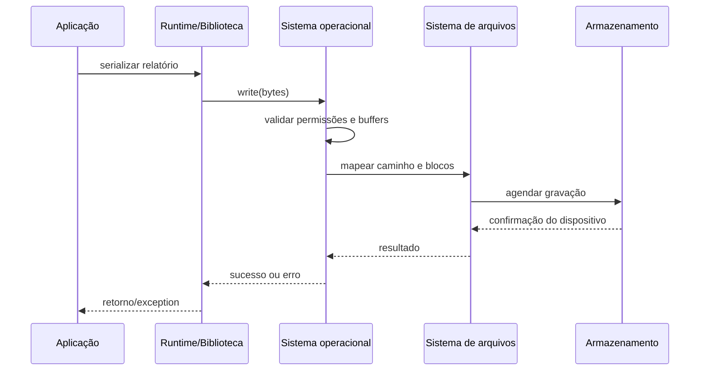
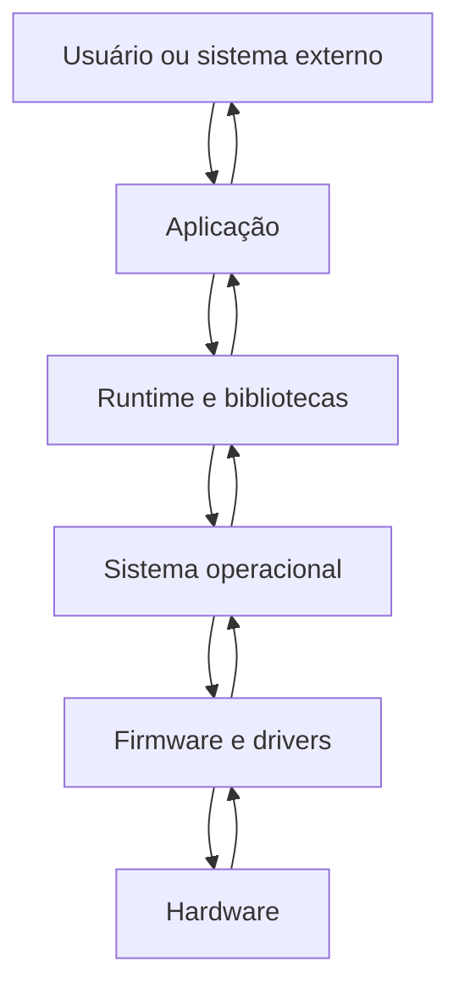
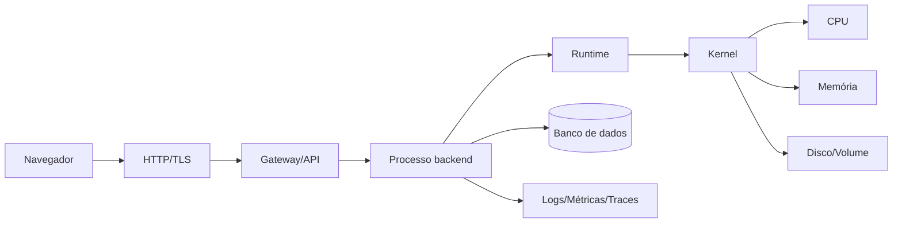
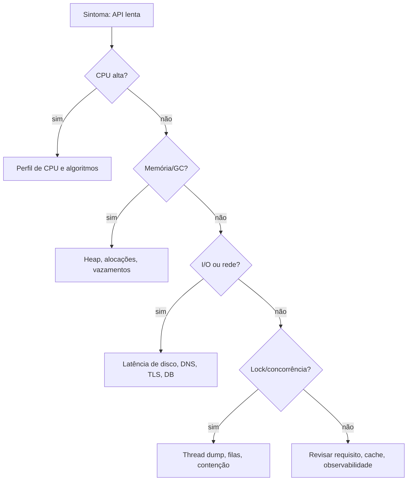

# 02. Hardware, software e camadas de abstração

## Status editorial

- **Estado editorial atual:** `final-gate`. O capítulo foi escrito como primeira execução controlada do `Content Production Orchestrator Agent` e permanece sem marcação automática de `approved`.
- **Tipo:** `foundation-chapter` com profundidade profissional inicial.
- **Perfis temáticos descobertos:** sistemas computacionais, camadas de abstração, runtime, memória, armazenamento, segurança de base, performance e observabilidade.
- **Benchmark editorial aplicado:** `Computer Systems: A Programmer's Perspective`, `Code`, `Operating Systems: Three Easy Pieces` e benchmark interno `reference-benchmarks/computer-systems.benchmark.md` como régua de profundidade, sem reprodução textual.

## Contexto

### Papel do capítulo na formação

O capítulo anterior definiu computação como transformação de representações por regras. Agora precisamos responder uma pergunta inevitável: **onde essa transformação realmente acontece?** Em um sistema real, a regra escrita por uma pessoa não salta magicamente da ideia para o resultado. Ela atravessa camadas: linguagem, compilador ou interpretador, runtime, bibliotecas, sistema operacional, firmware, CPU, memória, disco, rede e dispositivos.

Entender essas camadas não é nostalgia de baixo nível. É uma competência profissional. Uma API lenta, um container que consome memória demais, um arquivo corrompido, uma vulnerabilidade por dependência nativa, um vazamento de segredo em log, uma inconsistência após queda de energia ou um erro intermitente de concorrência raramente são explicados olhando apenas para a função de alto nível. O engenheiro precisa saber quando a abstração ajuda e quando ela esconde o problema.

## Pré-requisitos

Você deve compreender os conceitos de representação, regra, transformação, estado e invariantes do capítulo 01. Não é necessário conhecer eletrônica ou assembly. O objetivo não é formar um projetista de CPU, mas um desenvolvedor capaz de raciocinar sobre o caminho entre código, máquina e produção.

## Abertura forte

Imagine que a plataforma final do curso recebe uma requisição para gerar um resumo com IA de um atendimento técnico. A interface envia JSON, a API valida o usuário, o backend chama um modelo, grava o resultado, publica um evento e retorna resposta. Para o usuário, tudo parece uma operação única. Para a máquina, é uma cadeia de camadas: bytes chegam pela placa de rede, o kernel monta buffers, o runtime agenda callbacks ou threads, bibliotecas serializam objetos, o processador executa instruções, caches aceleram leituras, memória guarda estado temporário, disco persiste dados e mecanismos de segurança tentam impedir abuso.

Quando algo falha, a pergunta muda de “qual linha está errada?” para “em qual camada a suposição deixou de ser verdadeira?”. Essa mudança de pergunta é o início da maturidade em engenharia.

## Mapa do capítulo

1. Objetivos em três níveis.
2. Problema real: abstrações que falham em produção.
3. Definição técnica de hardware, software e camadas.
4. Decomposição das camadas, da CPU à aplicação.
5. Funcionamento interno de uma operação simples.
6. Modelo mental e diagramas Mermaid.
7. Exemplos simples e profissionais.
8. Segurança, performance, testes e observabilidade por camada.
9. Laboratórios e evidência de domínio.
10. Conexão com o projeto final e próximos capítulos.

## Objetivos

### Objetivos básicos, profissionais e especialistas

### Objetivos básicos

- Diferenciar hardware, firmware, sistema operacional, runtime, biblioteca e aplicação.
- Explicar por que software precisa de hardware para executar e por que hardware precisa de instruções para produzir comportamento útil.
- Descrever o caminho simplificado de uma operação: entrada, processamento, memória, persistência e saída.

### Objetivos profissionais

- Identificar custos escondidos por abstrações: CPU, memória, I/O, rede, serialização, locks, inicialização e dependências.
- Relacionar decisões de linguagem e runtime a diagnóstico, deploy, consumo de recursos e segurança.
- Projetar uma operação simples com limites explícitos de armazenamento, permissão, recuperação e observabilidade.

### Objetivos especialistas

- Raciocinar sobre vazamentos de abstração: quando o detalhe inferior aparece no comportamento superior.
- Investigar sintomas de produção usando hipóteses por camada.
- Justificar trade-offs entre produtividade, controle, portabilidade, performance, isolamento e superfície de ataque.

## Problema real

Uma equipe constrói um serviço de upload de arquivos para anexos de atendimentos técnicos. Em desenvolvimento tudo funciona. Em produção surgem problemas: uploads grandes derrubam instâncias, arquivos temporários lotam disco, antivírus corporativo atrasa gravações, logs registram nomes sensíveis, o container reinicia sem preservar evidências, e uma atualização de biblioteca muda o consumo de memória.

Nenhum desses problemas é visível se a equipe pensa apenas em “receber arquivo e salvar”. O requisito atravessa camadas: navegador, HTTP, gateway, processo do backend, runtime, buffers em memória, sistema de arquivos, volume, permissões, quotas, scanner, logs, métricas e política de retenção. A solução profissional exige modelar a cadeia inteira.

## Intuição

### Intuição fundamental

Uma camada de abstração é um acordo: ela oferece uma interface mais simples e esconde detalhes para permitir foco. O sistema de arquivos permite “abrir”, “ler” e “gravar” sem pensar em setores físicos; uma linguagem permite usar objetos sem escrever instruções de máquina; um container permite empacotar processo e dependências sem administrar manualmente cada biblioteca do host.

Mas todo acordo tem cláusulas escondidas. O arquivo pode não ser gravado se faltar espaço. O objeto pode pressionar o coletor de lixo. O container compartilha o kernel do host. A rede pode atrasar, duplicar ou perder pacotes. A abstração é útil enquanto suas premissas valem; quando elas quebram, o profissional precisa descer uma ou mais camadas.

## Conceito principal

### Definição técnica

**Hardware** é o conjunto de componentes físicos capazes de armazenar, transportar e transformar sinais: CPU, memória, armazenamento, dispositivos de entrada e saída, barramentos, interfaces de rede e aceleradores.

**Software** é o conjunto de instruções, dados, contratos e configurações que orienta o hardware a produzir comportamento útil.

**Camada de abstração** é uma fronteira conceitual e operacional que oferece uma interface mais estável para a camada acima, escondendo parte da complexidade da camada abaixo, mas preservando custos, limites e riscos.

## Explicação profunda

A explicação profunda deste capítulo está na relação causal entre camadas. Hardware não é apenas infraestrutura invisível; ele define limites físicos de execução, armazenamento, paralelismo, latência e falha. Software não é apenas texto; ele é uma descrição executável que depende de compilação, interpretação, bibliotecas, runtime, sistema operacional e dispositivos. Quando uma abstração promete simplicidade, ela não elimina custos: ela desloca custos para uma camada menos visível. Por isso, decisões profissionais devem perguntar quais recursos são consumidos, quais contratos são assumidos, quais falhas podem emergir e quais evidências permitirão diagnóstico. Essa visão evita tanto o baixo nível desnecessário quanto a fé ingênua em frameworks, containers, runtimes e serviços gerenciados.

### Decomposição da definição

| Elemento | O que oferece | O que esconde | O que pode vazar |
| --- | --- | --- | --- |
| CPU | Execução de instruções | Microarquitetura, cache, pipeline | Uso alto, contenção, instruções incompatíveis |
| Memória RAM | Acesso rápido a estado temporário | Endereçamento físico, páginas, cache | Vazamento, fragmentação, swapping |
| Armazenamento | Persistência | Blocos, latência, desgaste, fsync | Corrupção, falta de espaço, lentidão |
| Firmware | Inicialização e controle básico | Detalhes do dispositivo | Boot inseguro, atualização defeituosa |
| Sistema operacional | Processos, arquivos, rede, permissões | Drivers e chamadas de sistema | Permissão negada, limites, sinais, escalonamento |
| Runtime | Execução da linguagem | Alocação, garbage collection, event loop | Pausas, deadlocks, erros nativos |
| Aplicação | Regra de negócio | Infraestrutura interna | Bugs, falhas de contrato, abuso |

## Funcionamento interno

Quando um programa executa `salvarRelatorio(relatorio)`, várias operações acontecem. O runtime representa o objeto em memória. A biblioteca transforma esse objeto em bytes, geralmente JSON, Protobuf, texto ou formato binário. A aplicação pede ao sistema operacional para escrever esses bytes. O kernel valida permissões, encaminha a operação ao sistema de arquivos, usa cache de página, agenda escrita no dispositivo e retorna sucesso ou erro. O dispositivo pode confirmar antes ou depois da gravação física dependendo de cache, flush e política do sistema.

Esse caminho mostra por que “salvou” nem sempre significa a mesma coisa. Pode significar que a aplicação entregou bytes ao kernel, que o kernel colocou bytes em cache, que o disco recebeu a escrita, ou que a escrita sobrevive a queda de energia. Sistemas profissionais precisam escolher a semântica correta para cada dado. Um log de debug tolera perda. Um pagamento confirmado não tolera confirmação falsa.



## Modelo mental

Pense em cada camada como um contrato com quatro perguntas:

1. **Que interface ela oferece?** Funções, comandos, protocolos, arquivos, portas ou APIs.
2. **Que recurso ela consome?** CPU, memória, disco, rede, energia, locks, handles ou dinheiro.
3. **Que falhas ela pode gerar?** Timeout, permissão negada, indisponibilidade, corrupção, saturação ou erro lógico.
4. **Que evidência ela deixa?** Logs, métricas, traces, códigos de erro, eventos, arquivos ou dumps.



## Diagramas úteis

### Camadas em uma aplicação Full Stack



### Investigação por hipótese de camada



## Tabelas, quadros e matrizes

| Decisão | Ganho | Custo | Pergunta de revisão |
| --- | --- | --- | --- |
| Usar linguagem gerenciada | Produtividade, segurança de memória relativa | GC, overhead e menor controle fino | O consumo e as pausas são medidos? |
| Usar arquivo local | Simplicidade e baixa latência local | Perda em container efêmero e escala difícil | O dado precisa sobreviver ao restart? |
| Usar container | Reprodutibilidade e isolamento operacional | Imagens, camadas, kernel compartilhado | A imagem é mínima e roda sem root? |
| Usar biblioteca nativa | Performance ou recurso específico | Portabilidade e CVEs nativas | Há política de atualização e scan? |
| Esconder infraestrutura por framework | Velocidade inicial | Diagnóstico difícil em falhas | A equipe conhece os pontos de extensão? |

## Exemplo simples

Considere um script que lê um número e calcula o dobro. Conceitualmente ele transforma entrada em saída. Em camadas, ele envolve teclado ou argumento de linha de comando, representação textual, conversão para número, instruções da linguagem, runtime, CPU e memória.

```pseudo
entrada_texto = ler_entrada()
numero = converter_para_inteiro(entrada_texto)
resultado = numero * 2
imprimir(resultado)
```

Falhas simples já revelam camadas: a entrada pode não ser número, a conversão pode estourar limite, a saída pode falhar se o processo não tiver permissão de escrever no destino, e a multiplicação pode ter comportamento diferente dependendo do tipo numérico. Mesmo um exemplo mínimo ensina que software profissional começa com contratos explícitos.

## Implementação prática

### Exemplo profissional

Em uma plataforma SaaS de conhecimento, o backend recebe documentos para indexação e busca. A equipe precisa decidir onde processar arquivos grandes. A solução ingênua carrega o arquivo inteiro em memória, transforma em texto, chama um serviço de embeddings e grava tudo em banco. Funciona em teste com arquivos pequenos, mas quebra em produção.

A solução profissional trata camadas:

- usa streaming para reduzir pressão de memória;
- grava arquivo bruto em armazenamento apropriado, não em disco efêmero do container;
- registra metadados transacionais no banco;
- processa indexação em job assíncrono;
- limita tamanho e tipo de arquivo;
- calcula hash para deduplicação e auditoria;
- emite métricas de bytes processados, duração, falhas e retries;
- sanitiza logs para não vazar conteúdo sensível;
- documenta o contrato de persistência: o que é temporário, durável e reconstruível.

```pseudo
receber_upload(requisicao):
    autenticar_usuario()
    validar_tamanho_e_tipo(requisicao.arquivo)
    hash = calcular_hash_streaming(requisicao.arquivo)
    local = storage.persistir_stream(requisicao.arquivo, hash)
    documento = banco.criar_registro(status="RECEBIDO", hash=hash, local=local)
    fila.publicar("documento.recebido", documento.id)
    metricas.incrementar("uploads_recebidos")
    retornar 202, { id: documento.id, status: "RECEBIDO" }
```

Esse pseudocódigo ensina que a escolha técnica não é “usar streaming porque é bonito”. Streaming reduz uso de RAM, mas aumenta complexidade de validação, retries e tratamento parcial. Persistir em storage externo melhora durabilidade, mas introduz latência, credenciais e custo. A decisão profissional explicita o trade-off.

## Aplicação em sistemas reais

Sistemas reais combinam camadas de formas não óbvias. Um frontend moderno roda JavaScript no navegador, mas depende de CPU do dispositivo do usuário, memória limitada, políticas de sandbox e rede instável. Um backend em container parece isolado, mas compartilha kernel, rede virtual, limites de cgroup e volumes. Um banco gerenciado remove tarefas operacionais, mas não remove latência, locking, modelagem ruim ou custo de consulta.

A pergunta correta não é “qual camada é mais importante?”. A pergunta é “qual camada está no caminho crítico desta operação e qual evidência teremos se ela falhar?”.

## Conexão com Full Stack

No Full Stack, camadas aparecem em toda decisão: renderização no cliente ou servidor, cache no navegador ou backend, upload direto para storage ou via API, validação duplicada em frontend e backend, autenticação por cookie ou token, persistência em banco relacional ou documento. Um profissional Full Stack não precisa saber todos os detalhes de hardware, mas precisa entender que latência, memória, CPU, rede e armazenamento moldam a experiência do usuário.

## Conexão com IA

Aplicações de IA tornam camadas ainda mais visíveis. Embeddings consomem CPU/GPU e memória. Modelos têm limites de contexto. Vetores ocupam armazenamento. Chamadas a APIs externas têm latência, custo e risco de indisponibilidade. Dados sensíveis podem vazar em prompts ou logs. Uma abstração de “chamar IA” precisa ser quebrada em tokenização, contexto, transporte, avaliação, caching, fallback e auditoria.

## Conexão com Cybersegurança

Segurança também é por camadas. Hardware pode ter firmware vulnerável. Sistema operacional define permissões. Runtime pode ter dependências inseguras. Aplicação pode validar mal entradas. Container pode rodar como root. Logs podem expor segredos. TLS protege transporte, mas não corrige autorização fraca. A defesa profissional evita depender de uma única camada e registra controles complementares.

## Segurança

Neste capítulo, segurança significa reconhecer fronteiras de confiança por camada:

- **Hardware/firmware:** boot seguro, atualização confiável e inventário de máquinas importam em ambientes corporativos.
- **Sistema operacional:** permissões de arquivo, usuários, capabilities, patches e isolamento de processo reduzem impacto de comprometimento.
- **Runtime:** dependências, versões, módulos nativos e configuração de memória podem abrir vulnerabilidades.
- **Aplicação:** validação de entrada, autorização, tratamento de erro e logs seguros impedem abuso direto.
- **Operação:** segredos não devem ficar em código, imagem, log ou arquivo temporário sem proteção.

Critério prático: para cada dado sensível, pergunte em quais camadas ele aparece em texto claro, por quanto tempo fica armazenado e quem consegue acessá-lo.

## Performance

Performance é consumo de recurso sob restrição. CPU mede execução; memória mede estado temporário; disco mede persistência; rede mede comunicação; runtime mede overhead de execução; banco mede acesso a dados; observabilidade mede o custo de enxergar tudo isso.

O erro comum é otimizar a camada errada. Se a API está lenta por consulta sem índice, trocar linguagem não resolve. Se o gargalo é serialização de payload gigante, aumentar CPU mascara o problema. Se o container faz swapping por limite de memória, otimizar uma função específica pode ter pouco efeito. Medir antes de otimizar é uma regra de sanidade.

## Testes

Testar camadas não significa testar CPU diretamente. Significa criar evidências de que a aplicação respeita limites de camada:

- teste de contrato para tipos e formatos;
- teste de erro para falta de permissão, arquivo inexistente e timeout;
- teste de carga leve para detectar crescimento de memória;
- teste de integração com armazenamento temporário e persistente;
- teste de configuração para garantir que segredos não aparecem em logs;
- teste de recuperação para reinício de processo durante operação não crítica.

## Observabilidade

Observabilidade por camada exige sinais que permitam localizar falhas. Para um serviço simples, registre:

- logs estruturados com operação, correlação e resultado, sem dados sensíveis;
- métricas de CPU, memória, uso de disco, latência externa, tamanho de payload e taxa de erro;
- traces para operações que atravessam API, banco, storage e fila;
- eventos de domínio para mudanças importantes de estado;
- runbook com hipóteses por camada.

## Troubleshooting

Quando um erro aparecer, investigue em ordem disciplinada:

1. Qual operação falhou e qual contrato foi quebrado?
2. O erro é determinístico ou intermitente?
3. Há saturação de CPU, memória, disco ou rede?
4. A falha ocorre antes ou depois de persistir estado?
5. Permissões, caminhos, variáveis de ambiente e limites mudaram?
6. Há atualização recente de runtime, biblioteca, imagem ou host?
7. Logs e métricas confirmam a mesma hipótese?

Essa sequência evita a prática frágil de reiniciar tudo sem aprender nada.

## Limitações

Este capítulo não ensina eletrônica digital em profundidade, assembly detalhado, design de kernel, compiladores formais ou administração avançada de sistemas. Ele fornece o modelo mental necessário para que essas áreas façam sentido quando aparecerem. O risco é achar que conhecer o mapa substitui prática. Não substitui: diagnóstico real exige laboratório, medição e contato com falhas.

## Trade-offs

| Alternativa | Quando favorece | Quando prejudica |
| --- | --- | --- |
| Abstração alta | Entrega rápida, menos código acidental | Diagnóstico difícil, custos invisíveis |
| Controle baixo nível | Performance e previsibilidade | Complexidade, bugs de segurança, menor portabilidade |
| Persistência local | Simplicidade e baixa latência | Escala horizontal e durabilidade frágeis |
| Serviço gerenciado | Menos operação própria | Custo, lock-in e limites do provedor |
| Runtime gerenciado | Produtividade e segurança relativa | Pausas, overhead e menos previsibilidade |

## Erros comuns

- Acreditar que “está no container” significa isolamento completo.
- Confundir retorno de sucesso da aplicação com durabilidade real do dado.
- Carregar arquivos inteiros em memória sem limite.
- Logar payload sensível para “facilitar debug”.
- Ignorar permissões de arquivo em desenvolvimento e descobrir falhas só em produção.
- Otimizar código antes de medir o gargalo.
- Tratar framework como mágica e não como uma camada com contratos.

## Checklist

### Checklist profissional

- [ ] A operação crítica tem mapa de camadas?
- [ ] Entradas, saídas e estados persistidos estão definidos?
- [ ] Limites de tamanho, tempo, memória e permissões foram explicitados?
- [ ] Dados sensíveis foram rastreados por camada?
- [ ] Logs, métricas e traces permitem localizar a camada provável da falha?
- [ ] Existe plano de recuperação para falha no meio da operação?
- [ ] O projeto final registra decisões de runtime e persistência?

## Laboratório guiado

**Objetivo:** rastrear uma operação simples por camadas.

1. Escolha uma operação: salvar uma anotação em arquivo local.
2. Escreva o pseudocódigo da operação.
3. Liste as camadas envolvidas: aplicação, runtime, sistema operacional, sistema de arquivos e disco.
4. Para cada camada, registre uma falha possível.
5. Para cada falha, registre uma evidência esperada: mensagem de erro, log, métrica ou comportamento observável.
6. Reescreva o pseudocódigo incluindo validação de entrada e tratamento honesto de erro.

**Critério de aceite:** o relatório deve mostrar pelo menos cinco camadas, cinco falhas e cinco evidências, sem depender de frases genéricas.

## Laboratório profissional de diagnóstico

**Cenário:** a plataforma final precisa receber documentos para futura indexação por IA.

Produza um mini-design contendo:

1. Diagrama de camadas da operação de upload.
2. Limites máximos de tamanho, formato e tempo.
3. Decisão sobre armazenamento temporário e durável.
4. Estratégia para evitar vazamento de conteúdo em logs.
5. Métricas mínimas: bytes recebidos, duração, erros por causa, uso de memória e retries.
6. Plano de teste para arquivo grande, arquivo inválido, permissão negada e reinício do processo.
7. Registro de trade-offs: simplicidade versus durabilidade, streaming versus complexidade, storage local versus externo.

## Exercícios

### Exercícios guiados

1. Explique a diferença entre hardware, software, firmware, sistema operacional e runtime usando uma operação de login.
2. Descreva duas situações em que uma abstração de alto nível vaza detalhes de baixo nível.
3. Por que “gravar em arquivo” não garante automaticamente durabilidade após queda de energia?
4. Qual métrica ajudaria a diferenciar gargalo de CPU de gargalo de I/O?
5. Como um segredo pode vazar mesmo quando a aplicação usa HTTPS?

## Desafio

### Desafio prático

Crie um **Mapa de Camadas do Projeto Final** para a plataforma SaaS inteligente e segura. O artefato deve conter:

- uma operação de usuário escolhida;
- diagrama Mermaid das camadas;
- tabela de recursos consumidos;
- tabela de falhas por camada;
- controles de segurança;
- sinais de observabilidade;
- decisão sobre quais dados são temporários, duráveis e reconstruíveis.

## Revisão

### Perguntas de revisão

- Qual problema surge quando a equipe ignora o sistema operacional em uma aplicação containerizada?
- Por que runtimes gerenciados melhoram produtividade, mas não eliminam preocupação com memória?
- Como você provaria que uma lentidão está no banco e não na CPU da API?
- O que muda entre salvar um log e confirmar uma transação financeira?
- Qual camada você investigaria primeiro em erro de “permission denied” ao gravar arquivo?

## Evidência de domínio

Entregue um documento revisável chamado `evidencia-cap02-mapa-camadas.md` contendo:

1. mapa de camadas de uma operação real do projeto final;
2. justificativa de duas abstrações escolhidas;
3. análise de três vazamentos de abstração possíveis;
4. plano mínimo de segurança, performance, testes e observabilidade;
5. rubrica de autoavaliação com evidências, não opiniões.

## Conexão com projeto final

### Artefato para o projeto final integrado

O artefato deste capítulo é o **Mapa de Camadas Operacionais da Plataforma**. Ele será reutilizado nos capítulos de sistemas operacionais, processos, memória, redes, APIs, segurança e observabilidade. A cada novo capítulo, o mapa será refinado com detalhes de processo, comunicação, persistência, falha e defesa.

## Resumo conceitual

Hardware executa sinais e instruções. Software organiza instruções, dados e contratos. Camadas de abstração tornam sistemas possíveis de construir, mas não removem custos e limites. O profissional aprende a subir e descer camadas conforme o problema exige: usa abstrações para produzir, mas não se torna refém delas quando precisa diagnosticar.

## Conexão com próximos capítulos

O próximo capítulo aprofunda sistemas operacionais. Agora que você entende que aplicações dependem de camadas inferiores, ficará claro por que processos, arquivos, permissões, memória virtual, chamadas de sistema e escalonamento afetam diretamente software Full Stack, IA e Cybersegurança.

## Referências conceituais e próximos estudos

- Sistemas computacionais como integração de processador, memória, armazenamento, sistema operacional e aplicação.
- Modelos de abstração em engenharia de software.
- Conceitos introdutórios de arquitetura de computadores e sistemas operacionais.
- Práticas de diagnóstico por camada em aplicações web e serviços backend.
