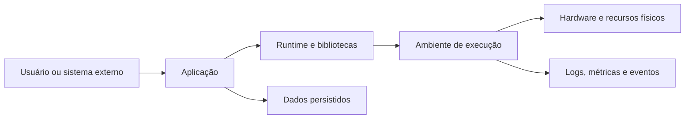

# 03. Sistemas operacionais

## Status editorial

- **Estado editorial atual:** `final-gate`. Capítulo produzido na execução controlada do Content Production Orchestrator; não marcado como `approved` automaticamente.
- **Escopo técnico:** kernel, chamadas de sistema, arquivos, drivers, permissões e virtualização.
- **Análise temática:** temas centrais declarados, risco de superficialidade mitigado por laboratório, evidência de domínio, segurança, performance, testes e observabilidade.
- **Benchmark aplicado:** capítulo de fundamentos com densidade comparável a material técnico robusto de sistemas de computação e engenharia de software.

## Papel do capítulo na formação

Este capítulo transforma fundamentos em competência operacional. Ele prepara o leitor para projetar, diagnosticar e defender sistemas reais, mantendo conexão com Full Stack, IA, Cybersegurança e o projeto final integrado.

## Pré-requisitos

Leitura dos capítulos anteriores, familiaridade com a ideia de camadas de abstração e disposição para investigar causas em vez de memorizar definições.

## Abertura forte

Um sistema profissional falha exatamente nas fronteiras que o iniciante costuma ignorar: recursos compartilhados, permissões, concorrência, limites de ambiente e sinais incompletos. Dominar sistemas operacionais é aprender a enxergar essas fronteiras antes que elas virem incidente.

## Mapa do capítulo

1. Objetivos e contexto.
2. Problema real e intuição.
3. Conceito principal, explicação profunda e funcionamento interno.
4. Exemplos simples e profissionais.
5. Segurança, performance, testes e observabilidade.
6. Laboratório, desafio, evidência de domínio e conexão com o projeto final.

## Objetivos

### Básico
- Explicar o conceito central em linguagem precisa.
- Relacionar o tema com hardware, software e aplicações.
- Identificar sinais práticos do tema em uma máquina de desenvolvimento.

### Profissional
- Diagnosticar problemas usando evidências observáveis.
- Tomar decisões explícitas de segurança, performance e testabilidade.
- Documentar limites e trade-offs antes de automatizar uma solução.

### Especialista
- Avaliar impactos em arquitetura Full Stack, IA e Cybersegurança.
- Diferenciar abstração conveniente de custo operacional escondido.
- Produzir evidência de domínio revisável para o projeto final integrado.

## Contexto

No Livro 1, este capítulo liga a visão de computação e camadas de abstração aos sistemas que serão construídos nos livros seguintes. O objetivo não é decorar comandos, mas formar um modelo mental que permita investigar comportamento real: onde a aplicação executa, quais recursos consome, quais fronteiras protegem dados e quais sinais aparecem quando algo degrada.

## Problema real

Imagine uma plataforma de cursos em produção. Um usuário envia um arquivo, uma API grava metadados, um worker processa o conteúdo e uma interface exibe o resultado. Quando a operação falha, a causa pode estar na aplicação, em permissões, em saturação de CPU, em bloqueio de disco, em disputa de recursos, em configuração insegura ou em uma premissa errada sobre isolamento. O profissional precisa transformar sintomas em hipóteses verificáveis.

## Conceito principal

O conceito principal deste capítulo é tratar a infraestrutura local de execução como parte do projeto de software. Código não roda no vazio: ele depende de recursos, políticas, filas, permissões, eventos e limites impostos por camadas inferiores. Um bom engenheiro especifica essas dependências em vez de supor que o ambiente sempre será benevolente.

## Intuição

A intuição útil é pensar em uma cidade. Há vias, regras, prédios, permissões, serviços públicos e limites de tráfego. Um aplicativo é como uma atividade econômica dentro dessa cidade: depende de ruas livres, energia, fiscalização, identidade e contratos. Quando muitas atividades competem, o desenho da cidade aparece. Em software, esse desenho aparece como latência, erros intermitentes, uso de memória, logs, contenção e falhas de segurança.

## Explicação profunda

A explicação profunda começa com uma mudança de postura: fundamentos não são curiosidades acadêmicas, são mecanismos que explicam incidentes reais. Cada operação visível em uma aplicação atravessa camadas com responsabilidades diferentes. A camada de domínio decide o que deve acontecer; a camada de runtime traduz intenções em operações executáveis; o sistema de execução controla recursos escassos; o hardware impõe limites físicos. Quando essas camadas são ignoradas, surgem bugs que parecem aleatórios: uma rotina funciona localmente e falha em produção, um teste passa isoladamente e falha em paralelo, uma permissão ampla demais vira vazamento, uma otimização reduz latência média mas aumenta cauda de latência.

O raciocínio profissional exige decompor uma ação em entrada, validação, autorização, alocação de recursos, execução, persistência, comunicação, observabilidade e limpeza. Para cada etapa, pergunte: quem controla o recurso, quem pode acessá-lo, qual limite existe, como o erro é reportado, como medir impacto e como recuperar estado seguro? Essa decomposição evita explicações vagas. Ela também conecta o capítulo a segurança, porque qualquer recurso sem fronteira clara vira superfície de ataque; a performance, porque todo recurso compartilhado pode saturar; e a testes, porque hipóteses sobre ambiente precisam ser simuladas.

Do ponto de vista especialista, a principal competência é reconhecer vazamentos de abstração. Frameworks e clouds simplificam a experiência, mas não removem custo. Uploads continuam usando descritores, buffers, disco ou rede. Workers continuam disputando CPU. Containers melhoram empacotamento, mas compartilham kernel. Ambientes serverless reduzem gestão operacional, mas introduzem cold start, limites de tempo e observabilidade específica. O engenheiro maduro não rejeita abstrações; ele as usa com contrato explícito, orçamento de recursos e plano de diagnóstico.

## Funcionamento interno

Internamente, uma requisição ou job atravessa uma cadeia de decisões. Primeiro, a entrada chega por uma interface: chamada HTTP, mensagem, arquivo, evento ou comando. Depois, o runtime solicita recursos ao ambiente: memória para buffers, acesso a arquivo, conexão de rede, tempo de CPU, relógio, variáveis de ambiente e primitivas de sincronização. Em seguida, políticas de isolamento e permissão decidem se a operação pode prosseguir. Por fim, o resultado precisa ser confirmado, registrado ou revertido.



O funcionamento interno deve ser observado por sinais. CPU alta sem aumento de throughput sugere espera, contenção ou algoritmo inadequado. Muitos erros de permissão indicam política incompatível com a execução. Crescimento contínuo de memória sugere retenção indevida, buffers grandes ou filas sem drenagem. Latência variável pode indicar disputa por recurso compartilhado. O ponto central é que um capítulo de fundamentos só é completo quando ensina a perguntar “qual mecanismo produziu este sintoma?” em vez de apenas listar definições.

## Exemplo simples

Um exemplo simples é criar um arquivo de relatório. A aplicação recebe dados, monta texto, abre um caminho, escreve bytes e fecha o recurso. Mesmo essa ação pequena envolve decisões: o caminho existe? o processo tem permissão? o arquivo pode ser sobrescrito? o conteúdo precisa ser temporário? como evitar escrita parcial? como testar sem modificar dados reais?

```pseudo
relatorio = montar_relatorio(dados_validos)
arquivo_temporario = abrir("relatorio.tmp", modo="criar_exclusivo")
escrever(arquivo_temporario, relatorio)
fechar(arquivo_temporario)
renomear_atomicamente("relatorio.tmp", "relatorio-final.txt")
```

O exemplo mostra que confiabilidade não nasce de uma chamada isolada. Ela nasce da combinação entre validação, permissão mínima, operação atômica e tratamento explícito de falha.

## Exemplo profissional

Em um sistema profissional, considere um serviço de processamento de certificados de conclusão. A API recebe o pedido, grava um evento, um worker gera PDF, armazena o artefato e publica uma notificação. O desenho robusto define limites de tamanho, diretório de trabalho isolado, usuário sem privilégios administrativos, timeout por job, fila com retentativas, idempotência por chave de certificado, logs estruturados e métricas de tempo por etapa. Se a geração falha, o sistema distingue erro de dados inválidos, indisponibilidade temporária, falta de permissão e saturação.

A decisão técnica não é “usar worker” de forma genérica. É declarar contrato operacional: quantos jobs simultâneos são seguros, qual memória máxima por geração, onde arquivos temporários ficam, como limpar resíduos, como evitar que um certificado de um aluno sobrescreva outro, como auditar acesso e como impedir que conteúdo malicioso force consumo excessivo. O capítulo é considerado profissional quando o leitor consegue revisar esse desenho e apontar riscos antes do incidente.

## Implementação prática

Para praticar, modele uma operação do projeto final: upload de material de aula, geração de relatório ou importação de usuários. Escreva uma ficha técnica com: recurso usado, dono do recurso, limite esperado, política de permissão, erro provável, métrica, log essencial, teste automatizado e procedimento de recuperação. Essa ficha se tornará parte do diário técnico do projeto final.

## Segurança

Segurança aqui significa reduzir privilégios, controlar fronteiras e tornar abuso detectável. Use o princípio do menor privilégio: processos e serviços devem acessar apenas diretórios, portas, variáveis e credenciais necessários. Não confie em nomes de arquivo recebidos do usuário; normalize caminhos e bloqueie travessia de diretórios. Não registre segredos em logs. Separe dados temporários por usuário ou job. Defina limites de tamanho e tempo para evitar negação de serviço por entrada grande. Em ambientes conteinerizados, lembre-se de que isolamento não é autorização automática: volumes montados, capabilities, usuário root no container e acesso à rede ainda precisam de revisão.

## Performance

Performance deve ser analisada por gargalo, não por palpite. Meça tempo de CPU, espera por I/O, memória alocada, filas, latência percentil 95/99 e throughput. Otimizações locais podem piorar o sistema: aumentar paralelismo pode saturar disco; cache pode consumir memória e servir dado obsoleto; buffers grandes reduzem chamadas mas aumentam pressão de memória. Um orçamento profissional define limites: tamanho máximo de arquivo, número de operações concorrentes, timeout, política de retry, backoff e degradação aceitável.

## Testes

Teste o comportamento normal e as falhas previsíveis. Inclua testes de permissão negada, caminho inexistente, recurso temporariamente indisponível, entrada acima do limite, operação interrompida e execução concorrente. Use diretórios temporários, fixtures pequenas e asserts sobre efeitos observáveis. Para cenários de produção, combine testes automatizados com ensaios de diagnóstico: reproduzir erro, capturar log, verificar métrica e confirmar recuperação.

## Observabilidade

Registre eventos com correlação: identificador da requisição, usuário ou tenant, recurso acessado, duração, resultado e categoria de erro. Métricas devem separar sucesso, falha permanente, falha transitória, tempo de fila e tempo de execução. Traces ajudam a visualizar em qual camada a operação ficou lenta. Sem observabilidade, fundamentos viram adivinhação.

## Troubleshooting

1. Reproduza o sintoma com entrada mínima.
2. Identifique recurso envolvido: CPU, memória, arquivo, rede, permissão ou fila.
3. Colete logs e métricas antes de alterar código.
4. Formule hipótese falsificável.
5. Aplique correção pequena.
6. Registre causa, evidência e prevenção.

## Limitações

Este capítulo não substitui documentação específica de Linux, Windows, macOS, runtimes ou provedores cloud. Também não cobre todos os detalhes de kernel, escalonadores, sistemas de arquivos ou virtualização. O objetivo é formar raciocínio transferível. Detalhes concretos variam por plataforma, versão, configuração e carga real.

## Trade-offs

Abstrações aumentam produtividade, mas podem esconder custo e limitar diagnóstico. Isolamento melhora segurança, mas exige configuração e pode dificultar integração. Paralelismo reduz tempo de resposta quando existe recurso disponível, mas aumenta complexidade e disputa. Permissões estritas reduzem impacto de invasão, mas exigem automação de configuração. Observabilidade aumenta capacidade de operação, mas gera custo e risco de expor dados sensíveis se logs forem mal desenhados.

## Erros comuns

- Assumir que ambiente local representa produção.
- Dar permissão ampla para “resolver rápido”.
- Não limitar tamanho de entrada.
- Tratar falhas transitórias e permanentes da mesma forma.
- Medir apenas média e ignorar cauda de latência.
- Escrever testes que dependem de estado global da máquina.

## Checklist

- [ ] Recursos e limites foram documentados.
- [ ] Permissões mínimas foram definidas.
- [ ] Falhas previsíveis têm tratamento específico.
- [ ] Logs não expõem segredos.
- [ ] Métricas permitem diagnosticar gargalo.
- [ ] Testes cobrem sucesso, falha e concorrência quando aplicável.

## Exercícios

1. Escolha uma operação de arquivo e liste cinco falhas possíveis.
2. Desenhe o fluxo de uma requisição até persistência.
3. Defina três métricas para diagnosticar lentidão.
4. Explique por que permissão ampla mascara problema de arquitetura.

## Desafio

Projete uma rotina de importação de CSV para o projeto final. Ela deve validar tamanho, registrar progresso, impedir sobrescrita indevida, recuperar falhas transitórias e produzir relatório de auditoria. Entregue diagrama, pseudocódigo, critérios de teste e riscos residuais.

## Revisão

Você deve conseguir explicar o mecanismo por trás de um sintoma operacional, diferenciar recurso, política e abstração, e propor testes que provem comportamento esperado. Se sua explicação depende de “deve funcionar”, revise o capítulo: engenharia profissional exige evidência.

## Conexão com projeto final

Atualize o projeto final com uma seção “contrato de execução”. Para cada serviço, declare recursos, permissões, limites, sinais de observabilidade, testes e decisão de isolamento. Essa entrega será usada nos capítulos de redes, segurança, observabilidade, DevOps e projeto integrador.

## Evidência de domínio

A evidência mínima é uma ficha revisável contendo: diagrama do fluxo, tabela de recursos, matriz de riscos, testes executáveis ou pseudocódigo testável, logs esperados e justificativa de trade-offs. A evidência deve permitir que outro leitor reproduza o raciocínio sem perguntar ao autor.

## Referências conceituais e próximos estudos

Estude documentação do sistema operacional usado no seu ambiente, conceitos de processos, arquivos, permissões, containers, observabilidade e confiabilidade. O próximo capítulo aprofunda concorrência, processos, threads, sincronização e deadlocks.

## Laboratório guiado

Execute a análise em papel ou em um repositório de estudo: escolha uma operação simples, desenhe o fluxo, liste recursos, defina limites e escreva pseudocódigo. Depois injete três falhas: permissão negada, entrada grande e execução simultânea. Para cada falha, registre sintoma, causa provável, log esperado, métrica útil e correção.

## Laboratório profissional

Monte uma revisão técnica do serviço de certificados do projeto final. Entregáveis: diagrama Mermaid, tabela de recursos, matriz de permissões, orçamento de performance, plano de testes, política de logs e riscos residuais. A revisão deve apontar pelo menos uma decisão que melhora segurança e uma que melhora diagnóstico sem esconder trade-offs.

## Perguntas de revisão

1. Qual abstração facilita o desenvolvimento, mas pode esconder custo?
2. Qual métrica diferenciaria gargalo de CPU de espera por I/O?
3. Como uma política de permissão mínima muda o desenho de testes?
4. Qual falha seria permanente e qual seria transitória no exemplo profissional?

## Resumo conceitual

O tema do capítulo não é apenas uma definição. É uma lente para explicar comportamento executável sob limites. Quem domina essa lente projeta com menos improviso, testa com hipóteses melhores, opera com sinais mais úteis e reduz risco de segurança.

## Conexão com próximos capítulos

A próxima etapa aprofunda os mecanismos que tornam execução simultânea possível e perigosa: processos, threads, escalonamento, sincronização, deadlocks e paralelismo.
