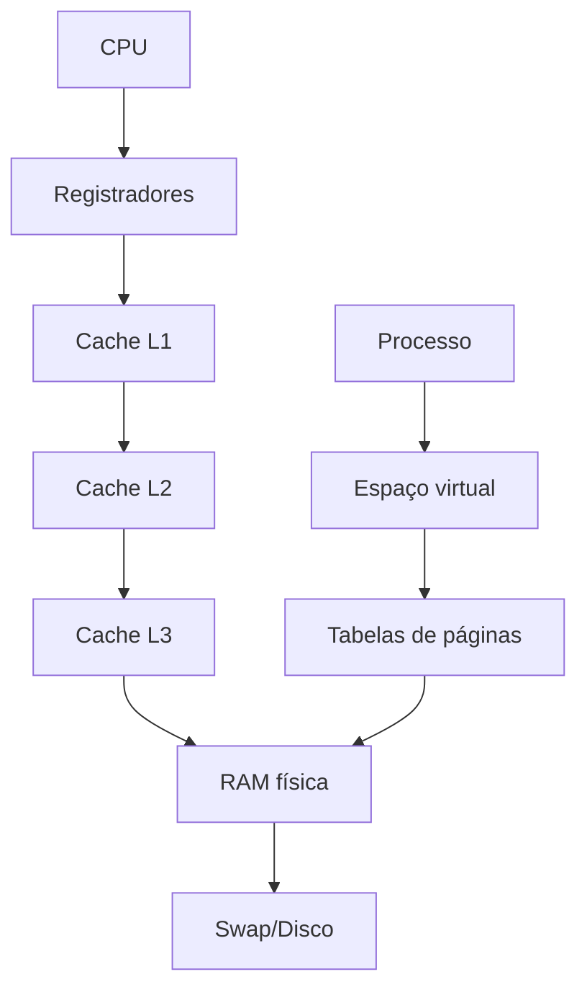
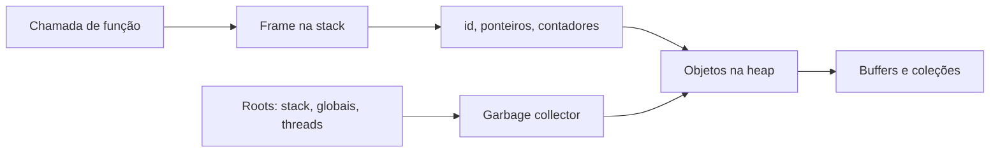
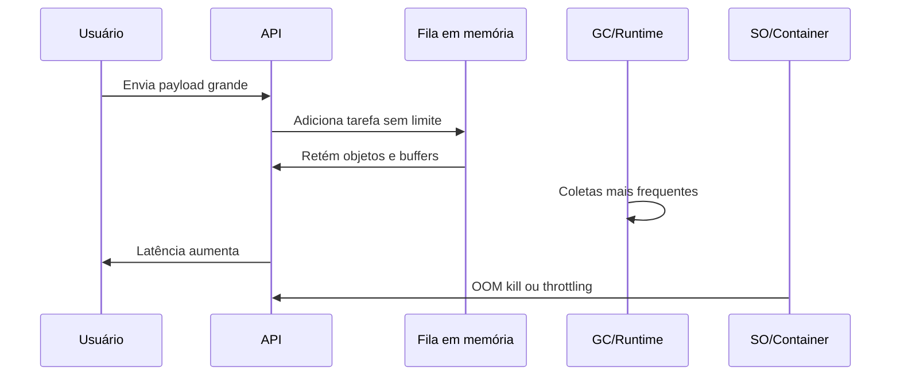

# 05. Memória

> **Status editorial:** `final-gate`. Capítulo produzido em profundidade especialista, ainda sem marcação `approved` porque a política do repositório exige gate final explícito e/ou revisão humana para aprovação definitiva.

## Papel do capítulo na formação

Memória é o ponto em que a abstração deixa de ser gratuita. Um sistema full stack pode parecer correto em testes funcionais e ainda falhar em produção por vazamento de objetos, uso excessivo de buffers, pressão de garbage collection, paginação, falta de localidade, cópias desnecessárias, cache mal dimensionado ou exposição acidental de dados sensíveis. Este capítulo transforma memória de “recurso invisível” em objeto de projeto, diagnóstico, segurança e performance.

## Pré-requisitos

- Capítulos 01 a 04: abstrações, hardware/software, sistemas operacionais, processos e concorrência.
- Noções iniciais de função, variável, processo, arquivo, rede e teste.
- Disposição para medir em vez de confiar apenas em intuição.

## Abertura forte

Quando uma aplicação cai por falta de memória, quase nunca o problema começou no momento do erro. Ele começou quando uma fila sem limite foi aceita, quando um cache não ganhou política de expiração, quando logs guardaram payloads grandes, quando uma rotina carregou o arquivo inteiro em RAM, quando uma coleção global reteve referências ou quando um runtime escondeu custos de alocação até o tráfego crescer. Profissionais experientes não tratam memória como detalhe de baixo nível: tratam como contrato operacional.

## Mapa do capítulo

1. Vocabulário essencial: endereço, byte, stack, heap, página, cache e referência.
2. Modelo interno: processo, espaço de endereçamento, memória virtual, paginação e caches de CPU.
3. Runtimes: alocação manual, garbage collection, referências e vazamentos lógicos.
4. Produção: limites, filas, buffers, caches, uploads, observabilidade e incidentes.
5. Segurança: exposição residual, DoS por memória, parsing inseguro e isolamento.
6. Laboratórios: vazamento simulado, localidade e diagnóstico profissional.

## Objetivos

### Objetivos básicos

- Explicar a diferença entre stack, heap, memória virtual, memória física e cache de CPU.
- Descrever por que variáveis, objetos, buffers e arquivos têm custos diferentes.
- Reconhecer sintomas de consumo anormal de memória.

### Objetivos profissionais

- Projetar limites de memória para filas, uploads, caches, paginação e processamento em lote.
- Diagnosticar crescimento de heap, vazamento lógico, pressão de GC e falta de localidade.
- Definir métricas e testes que detectem regressões de memória antes da produção.

### Objetivos especialistas

- Relacionar TLB, páginas, cache lines, localidade temporal/espacial e layout de dados com performance.
- Explicar como decisões de runtime e arquitetura afetam segurança e disponibilidade.
- Produzir uma análise revisável de memória com trade-offs e recomendações.

## Contexto

Este capítulo integra fundamentos de sistemas com decisões profissionais de arquitetura, operação, segurança e qualidade. O contexto é a construção progressiva da plataforma SaaS inteligente e segura, onde conceitos aparentemente básicos precisam virar critérios práticos de desenho, diagnóstico e revisão.

## Problema real

Na plataforma SaaS final, usuários enviarão documentos, atendimentos gerarão transcrições, componentes de IA manipularão chunks e embeddings, e APIs manterão sessões, permissões e logs. Se cada requisição carregar documento inteiro, duplicar buffers, manter payload em memória após resposta e alimentar um cache sem TTL, a aplicação falhará por OOM, latência de GC ou degradação progressiva. O problema deste capítulo é responder: **como projetar e operar memória antes que ela vire incidente?**

## Conceito principal

O conceito principal é tratar o tema como uma cadeia de mecanismos técnicos observáveis, com custos e falhas específicas, em vez de uma abstração invisível. A competência esperada é converter vocabulário em decisão de engenharia: limite, medição, proteção, teste e operação.

## Intuição

Memória é uma bancada de trabalho limitada. A stack guarda o que está em uso imediato na chamada atual. A heap guarda objetos que precisam sobreviver além de uma chamada. A memória virtual dá a cada processo a ilusão de um espaço próprio. O cache aproxima dados usados com frequência do processador. O erro comum é acreditar que, por existir abstração, o custo desaparece. A abstração organiza o custo; ela não elimina custo.

## Definição técnica

Memória, em um sistema computacional moderno, é o conjunto hierárquico de espaços de armazenamento volátil e mecanismos de endereçamento usados por processos, runtimes e hardware para representar estado em execução. Essa hierarquia inclui registradores, caches, memória principal, páginas virtuais, stack, heap, buffers, arenas de alocação e estruturas gerenciadas por runtime.

## Decomposição da definição

| Elemento | Função | Custo principal | Falha típica |
|---|---|---|---|
| Registradores | Operações imediatas da CPU | Escassez extrema | código gerado ineficiente |
| Cache L1/L2/L3 | Aproximar dados da CPU | misses e invalidações | layout ruim e falsa contenção |
| RAM | Estado ativo dos processos | capacidade e latência | OOM e swapping |
| Memória virtual | Isolamento e mapeamento | page faults e TLB misses | pressão de paginação |
| Stack | Chamadas e variáveis locais | tamanho limitado | stack overflow |
| Heap | Objetos dinâmicos | fragmentação, GC, vazamento | crescimento indefinido |
| Buffers | I/O e transformação | cópia e retenção | payload grande demais |

## Explicação profunda

A explicação profunda conecta o modelo conceitual às consequências operacionais. O estudante deve entender causas, efeitos e evidências: quais componentes participam, quais custos aparecem sob carga, quais falhas são prováveis, quais medições confirmam hipóteses e quais decisões reduzem risco sem ocultar complexidade. Uma leitura especialista também exige separar o que é garantia do sistema operacional, o que é contrato do runtime, o que é política de infraestrutura e o que é responsabilidade da aplicação. Essa separação evita duas falhas frequentes: culpar a camada errada e aplicar correção local que apenas desloca o gargalo. O critério de domínio é conseguir explicar o mecanismo, medir seu comportamento e justificar uma decisão operacional auditável.

## Funcionamento interno

Um processo não manipula diretamente toda a RAM física. O sistema operacional oferece um espaço de endereçamento virtual. Endereços virtuais são mapeados para páginas físicas por tabelas de páginas, com aceleração por TLB. Quando o processo acessa uma página ainda não carregada, ocorre page fault. Quando falta memória física, o SO pode matar processos, comprimir páginas ou mover dados para swap, dependendo do ambiente.

No nível do runtime, alocar um objeto significa reservar espaço, inicializar metadados e retornar uma referência. Em linguagens com garbage collector, liberar memória não ocorre quando a variável sai do escopo, mas quando o coletor conclui que não há referências alcançáveis. Isso evita várias classes de erro, mas cria outras: retenção acidental, pausas, promoção para gerações antigas e pressão de heap.

### Visual 1 — hierarquia de memória



O diagrama mostra que “acessar memória” não é uma operação única. Em sistemas reais, uma mudança de estrutura de dados pode reduzir cache misses; uma fila sem limite pode pressionar RAM; um container com limite baixo pode matar o processo antes do host esgotar memória.

### Visual 2 — stack, heap e referências



A stack contém raízes que podem apontar para objetos na heap. Se uma referência global aponta para uma coleção crescente, o GC não pode liberar os objetos, mesmo que o negócio já não precise deles. Esse é o vazamento lógico mais comum em runtimes gerenciados.

### Visual 3 — ciclo de incidente de memória



O incidente raramente é apenas “falta de RAM”. Ele é resultado de ausência de limite, falta de backpressure, retenção indevida e observabilidade tardia.

## Modelo mental

Pense em memória por quatro perguntas:

1. **Quanto entra?** tamanho do payload, cardinalidade, concorrência e burst.
2. **Quanto fica?** objetos retidos, caches, filas, sessões e buffers.
3. **Quanto duplica?** parsing, serialização, logs, cópias e transformações.
4. **Quando sai?** escopo, expiração, confirmação, streaming, desalocação ou GC.

## Matriz de decisão

| Situação | Estratégia preferível | Risco se ignorar |
|---|---|---|
| Upload grande | streaming + limite de tamanho | OOM por buffer inteiro |
| Lista paginável | paginação/cursor | carregar base inteira |
| Cache local | TTL + limite + métrica de hit | crescimento indefinido |
| Fila interna | tamanho máximo + backpressure | retenção até queda |
| Processamento IA | chunking + lote controlado | custo explosivo de tokens e RAM |
| Diagnóstico | heap snapshot + métricas | achismo e correções frágeis |

## Exemplo simples

### Exemplo simples explicado passo a passo

Imagine uma função que soma números. A versão ingênua cria uma nova lista só para filtrar valores positivos; a versão cuidadosa processa em streaming.

```pseudo
fun somaPositivosIngenua(numeros):
    positivos = []
    para n em numeros:
        se n > 0:
            positivos.adicionar(n)
    total = 0
    para p em positivos:
        total = total + p
    retornar total

fun somaPositivosStreaming(numeros):
    total = 0
    para n em numeros:
        se n > 0:
            total = total + n
    retornar total
```

Passo a passo: a primeira versão é fácil de ler, mas duplica parte da entrada na heap. Para mil itens, isso é irrelevante. Para cem milhões, pode ser a diferença entre terminar e cair. A segunda versão reduz retenção, mas pode perder a utilidade intermediária de inspecionar `positivos`. A decisão profissional depende do volume, da necessidade de auditoria e do custo de recomputação.

## Exemplo profissional

O exemplo profissional aproxima o conceito do projeto final integrado. Ele inclui entrada, validação, regra de negócio, transformação, falhas, segurança, performance, logs, métricas e critério de teste. O objetivo não é mostrar uma receita universal, mas demonstrar como um engenheiro transforma fundamento em fluxo operável, com limites explícitos e evidência observável.

### Exemplo profissional realista

Cenário: endpoint de ingestão de documentos para a plataforma SaaS. O usuário envia um PDF; o backend extrai texto, quebra em chunks e agenda indexação para IA.

Fluxo robusto:

1. Validar autenticação e autorização antes de ler o corpo inteiro.
2. Aplicar limite de tamanho por plano do tenant.
3. Fazer streaming para armazenamento temporário, calculando hash incremental.
4. Extrair texto em lotes, sem manter todas as páginas simultaneamente.
5. Criar chunks com tamanho máximo e registrar metadados mínimos.
6. Enfileirar IDs de chunks, não payload completo.
7. Emitir métricas de bytes, tempo de extração, heap usado e falhas.
8. Remover arquivos temporários e referências após conclusão.

```pseudo
fun ingestirDocumento(request, tenant):
    autorizar(tenant, request.usuario, "documento:criar")
    limitarBytes(request.contentLength, tenant.plano.maxUploadMb)

    arquivoTemp = storage.criarTemporario()
    hash = sha256.iniciar()

    para bloco em request.stream:
        hash.atualizar(bloco)
        arquivoTemp.escrever(bloco)
        metricas.contar("ingest.bytes", tamanho(bloco), tenant)

    para pagina in extrator.lerPaginas(arquivoTemp):
        para chunk in chunker.criar(pagina.texto, maxTokens=800):
            id = repositorio.salvarMetadadoChunk(tenant.id, hash.valor(), chunk.resumoSeguro())
            fila.publicar({"chunkId": id})

    arquivoTemp.remover()
    metricas.medidor("ingest.heap.after", runtime.heapUsado())
```

A regra central é não transportar payload pesado além da fronteira necessária. Persistência guarda bytes; fila carrega identificadores; logs registram metadados; métricas registram tamanho e latência; testes validam limites.

## Implementação prática

A implementação prática exige transformar o conceito em contratos, limites, comandos, métricas, testes e critérios de aceite. Não basta saber nomear o mecanismo; é preciso desenhar como ele será usado, monitorado, protegido e revisado no sistema final.

## Aplicação em sistemas reais

- **APIs:** evitar `bodyParser` ilimitado, limitar JSON e multipart, recusar payload cedo.
- **Backend:** controlar caches locais, pools, filas, conexões, buffers e objetos por requisição.
- **Frontend:** evitar estados globais com listas gigantes, imagens não otimizadas e retenção de listeners.
- **IA:** chunking, embeddings e reranking exigem orçamento de memória por lote.
- **Cybersegurança:** payload grande, compressão maliciosa e parsing custoso podem virar DoS.

## Conexão com Full Stack

Full stack moderno atravessa navegador, API, banco, fila e IA. Uma decisão de UI como permitir anexos múltiplos sem validação afeta memória no browser e no backend. Uma decisão de API como aceitar JSON aninhado afeta parsing. Uma decisão de banco como retornar milhares de linhas afeta heap do serviço e renderização do cliente.

## Conexão com IA

Pipelines de IA manipulam documentos, chunks, vetores e respostas. Memória aparece em batching, context window, deduplicação, armazenamento temporário e reranking. O profissional precisa estimar bytes por documento, vetores por tenant e concorrência máxima antes de prometer escala.

## Conexão com Cybersegurança

Memória é superfície de ataque. Exemplos: negação de serviço por payload gigante, zip bomb, vazamento de segredo em heap dump, tokens em logs, dados residuais em buffers reutilizados e falhas nativas como buffer overflow em bibliotecas de parsing. Mesmo em linguagens seguras, retenção indevida de PII é incidente de segurança.

## Segurança

Segurança aqui não é uma seção genérica: ela identifica como o tema pode expor dados, ampliar privilégios, permitir negação de serviço ou reduzir capacidade de investigação. Cada decisão técnica precisa ser avaliada quanto a confidencialidade, integridade, disponibilidade, isolamento entre tenants, rastreabilidade e manuseio seguro de artefatos sensíveis.

### Segurança específica do tema

- Defina limite de tamanho por endpoint e por tenant.
- Nunca inclua heap dump, payload bruto ou segredo em artefato sem classificação.
- Higienize buffers que carregam chaves quando a linguagem permitir e prefira stores próprios para segredo.
- Trate parsers de arquivo como componentes de risco: isole, limite tempo e tamanho, registre versão.
- Use quotas para impedir que um tenant consuma memória de todos.

## Performance

Performance deve ser tratada como comportamento mensurável sob restrição. A pergunta profissional não é se a solução parece rápida em ambiente local, mas qual é seu custo em latência, throughput, uso de recursos, cauda p95/p99, concorrência, degradação e recuperação após falha. Toda otimização precisa preservar corretude e segurança.

### Performance específica do tema

- Reduza alocação em hot paths, mas só depois de medir.
- Prefira streaming para dados grandes.
- Escolha estruturas contíguas quando localidade importar.
- Evite cópias entre camadas: bytes → string → JSON → objeto → log.
- Observe GC: frequência, duração, heap pós-coleta e promoção.
- Teste sob concorrência, porque memória por requisição multiplicada por requisições simultâneas define o pico.

## Testes

### Testes específicos do tema

- Teste de limite: payload acima do máximo deve falhar cedo.
- Teste de regressão: operação repetida mil vezes não deve crescer heap indefinidamente.
- Teste de carga: simular concorrência realista e medir pico de memória.
- Teste de segurança: zip bomb ou JSON profundamente aninhado deve ser recusado.
- Teste de limpeza: arquivos temporários e referências devem ser liberados após falha.

## Observabilidade específica do tema

Métricas mínimas:

- `process.memory.rss`, `heap.used`, `heap.committed` ou equivalente do runtime.
- Duração e contagem de GC.
- Tamanho de filas e caches.
- Bytes recebidos por endpoint.
- OOM kills em container.
- Tempo de parsing e extração.

Logs devem registrar IDs, tamanhos e decisões, não payload bruto. Traces devem marcar operações que alocam muito, como parsing, extração, serialização e geração de embeddings.

## Troubleshooting

| Sintoma | Hipótese | Evidência | Ação |
|---|---|---|---|
| Memória cresce continuamente | retenção de referência | heap snapshot comparativo | remover cache/global/listener |
| Latência em picos | pressão de GC | métricas de GC | reduzir alocação e concorrência |
| OOM em uploads | buffering inteiro | tamanho de payload + stack trace | streaming e limite |
| RSS alto, heap estável | memória nativa/buffers | métricas nativas | revisar libs e buffers |
| Queda só em um tenant | quota ausente | uso por tenant | aplicar limite e isolamento |

## Limitações

- Nem todo crescimento é vazamento; caches aquecem e runtimes reservam heap.
- Heap dump pode conter dados sensíveis e deve ser tratado como segredo.
- Otimização de memória pode piorar legibilidade e aumentar risco de bug.
- Métrica agregada pode esconder consumo por tenant ou endpoint.
- GC resolve desalocação, não resolve modelo de retenção mal projetado.

## Trade-offs

| Decisão | Benefício | Custo |
|---|---|---|
| Streaming | baixo pico de memória | código mais complexo |
| Cache local | menor latência | risco de stale data e crescimento |
| Heap maior | menos GC imediato | maior custo e pausas potenciais |
| Estrutura compacta | melhor localidade | menor flexibilidade |
| Limite rígido | previsibilidade | rejeições que exigem UX clara |

## Erros comuns

- Medir apenas CPU e ignorar memória.
- Guardar payload inteiro em log para “debug”.
- Usar cache sem TTL, tamanho máximo e métrica.
- Enfileirar objetos completos em vez de IDs.
- Confundir “linguagem com GC” com “sem vazamento”.
- Diagnosticar OOM sem correlacionar tráfego, payload e deploy.

## Checklist

### Checklist profissional

- [ ] Cada endpoint tem limite de tamanho documentado.
- [ ] Filas e caches têm limite, TTL e métrica.
- [ ] Uploads grandes usam streaming.
- [ ] Heap dumps são protegidos como dados sensíveis.
- [ ] Testes de carga medem pico de memória.
- [ ] Métricas de GC e RSS estão no dashboard.
- [ ] Existe runbook para OOM.

## Laboratório guiado — alocação, vazamento simulado e localidade

**Objetivo:** observar diferença entre alocação transitória, retenção e acesso com/sem localidade.

**Cenário:** criar três pequenos programas ou scripts: um que aloca e libera, outro que retém objetos em lista global, outro que percorre matriz por linha e por coluna.

**Pré-requisitos:** runtime com medição de memória, terminal e ferramenta de monitoramento do processo.

**Passos:**

1. Execute o programa transitório por 60 segundos e registre memória inicial/final.
2. Execute o programa com retenção global e registre crescimento.
3. Compare acesso sequencial e acesso saltado em matriz grande.
4. Gere gráfico simples de tempo e memória.
5. Escreva conclusão sobre retenção e localidade.

**Entregável:** relatório com código, comandos, tabela de medições e conclusão.

**Critério de avaliação:** o relatório distingue alocação de vazamento, explica localidade e propõe limite operacional.

**Extensão opcional:** repetir com limite de container e observar OOM kill.

**Conexão com projeto final:** aplicar a conclusão ao fluxo de ingestão de documentos.

## Laboratório profissional — diagnóstico de memória no SaaS

**Objetivo:** projetar um runbook de memória para o serviço de ingestão.

**Cenário:** um tenant envia muitos documentos grandes; a API fica lenta e reinicia.

**Passos:**

1. Desenhe o fluxo de ingestão e marque pontos de alocação.
2. Defina métricas por etapa: upload, parsing, chunking, fila e persistência.
3. Especifique limites por plano.
4. Escreva hipótese de incidente e evidências necessárias.
5. Crie ADR com decisão de streaming e enfileiramento por ID.

**Entregável:** ADR + runbook + diagrama.

**Critério de avaliação:** a solução reduz pico de memória sem esconder falhas e inclui segurança de dados.

## Exercícios

### Exercícios guiados

1. Explique por que uma lista global pode causar vazamento em linguagem com GC.
2. Compare carregar arquivo inteiro versus streaming para um upload de 500 MB.
3. Defina três métricas para detectar pressão de GC.
4. Modele política de cache para dados de configuração por tenant.
5. Descreva risco de segurança de um heap dump.

## Desafio

### Desafio prático

Crie uma análise de memória para o fluxo “upload de documento → extração → chunking → indexação”. Inclua orçamento de memória por requisição, concorrência máxima, limites por tenant, métricas, testes e plano de resposta a OOM.

## Revisão

### Perguntas de revisão

1. Qual diferença entre stack e heap?
2. Por que memória virtual melhora isolamento?
3. Quando GC não consegue liberar um objeto?
4. Como localidade afeta performance?
5. Como um atacante pode explorar consumo de memória?
6. Quais evidências confirmam vazamento lógico?

## Evidência de domínio

O estudante deve entregar uma **análise de memória revisável** contendo diagrama, medições, hipóteses, ADR, limites, testes e runbook. A evidência é aceita apenas se conectar decisão técnica a impacto em segurança, performance e operação.

## Conexão com projeto final

O capítulo contribui diretamente para o projeto final ao exigir um artefato revisável, versionado e conectado à operação real da plataforma SaaS inteligente e segura.

## Artefato para o projeto final integrado

Criar `projects/projeto-final-plataforma-saas-inteligente/adr/ADR-0001-memoria-ingestao-documentos.md` com a decisão de streaming, limites por tenant, métricas e política de heap dump.

## Resumo conceitual

Memória é hierarquia, contrato e risco operacional. Stack e heap organizam estado; memória virtual isola processos; cache e localidade definem performance; GC reduz erros manuais, mas não elimina retenção indevida; produção exige limites, métricas e runbook.

## Conexão com próximos capítulos

O próximo capítulo usa memória como base para redes: buffers, sockets, TLS, filas de conexão e latência dependem diretamente de alocação, limites e observabilidade.

## Referências conceituais e próximos estudos

- Sistemas de computação e hierarquia de memória.
- Sistemas operacionais, paginação e isolamento.
- Guias de runtime sobre garbage collection e profiling.
- Práticas de segurança para tratamento de dumps, payloads e arquivos temporários.
