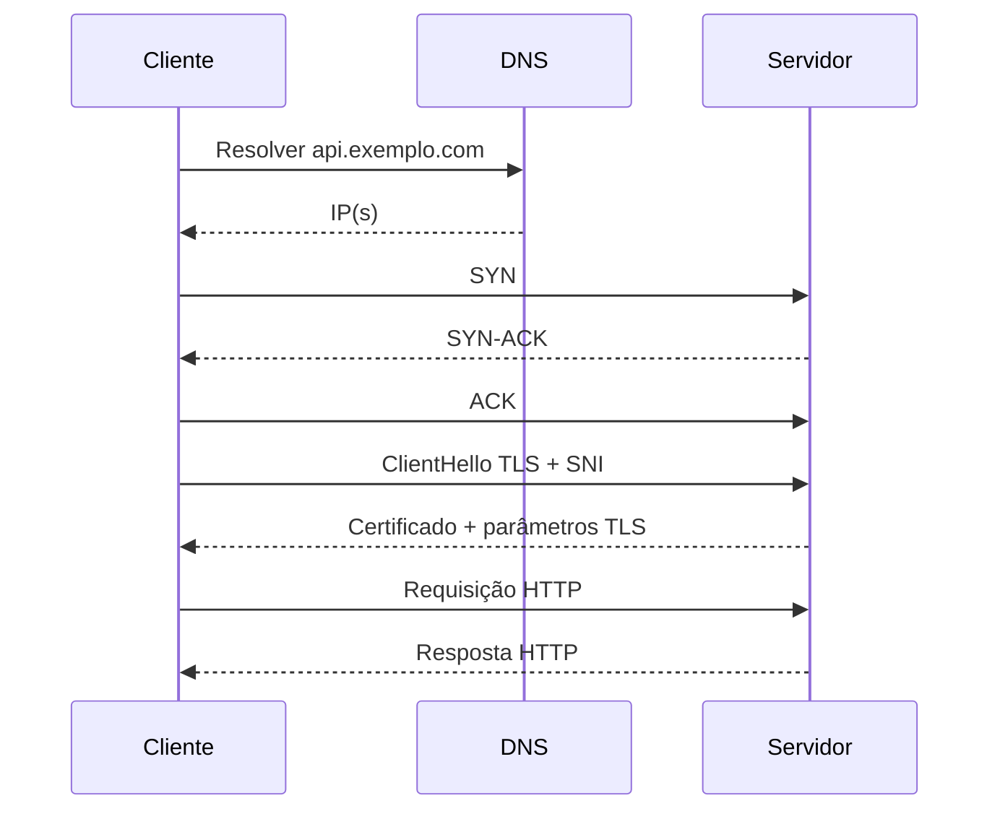
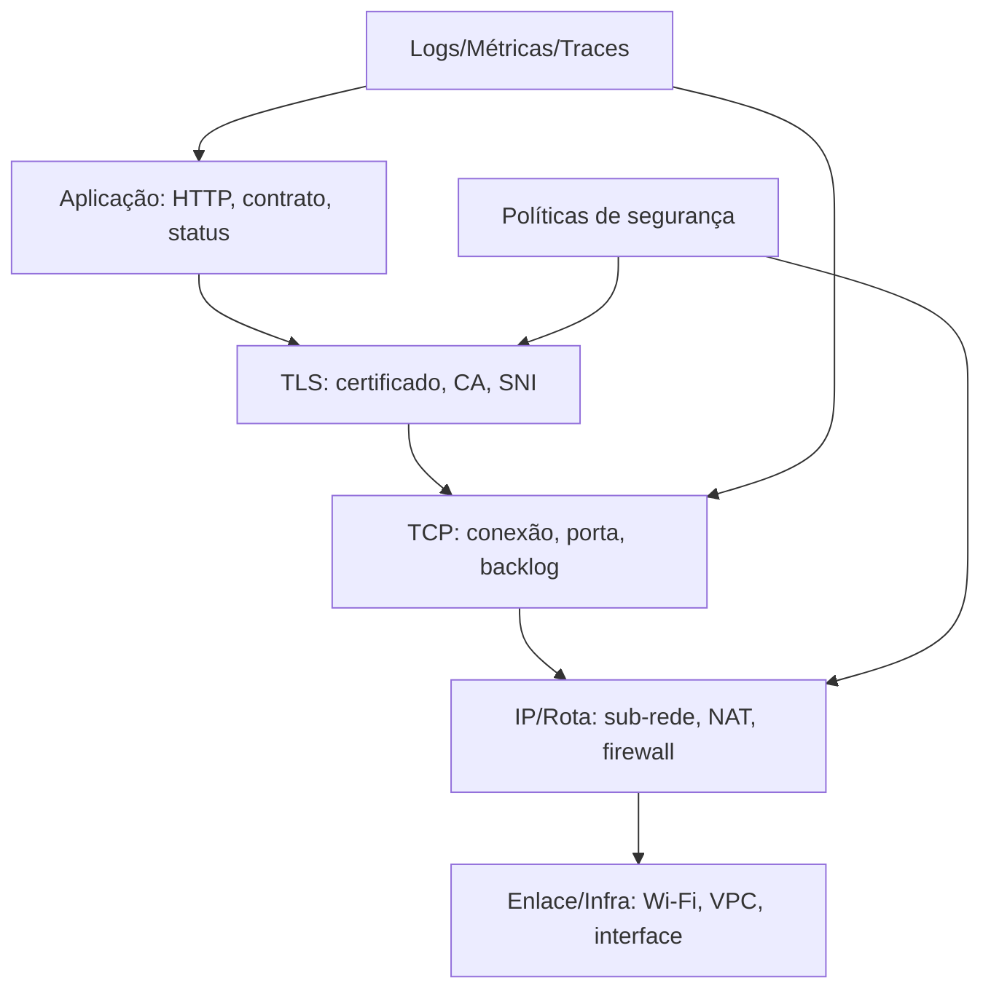

# 06. Redes de computadores

> **Status editorial:** `final-gate`. Capítulo produzido com foco profissional e profundidade operacional, aguardando revisão final explícita antes de qualquer aprovação.

## Papel do capítulo na formação

Redes explicam por que uma API que funciona localmente falha em produção: DNS demora, TLS expira, porta está fechada, firewall bloqueia, NAT altera origem, pacote perde, latência aumenta, proxy corta conexão, retry amplifica tráfego ou timeout está mal dimensionado. Este capítulo ensina redes como competência de engenharia aplicada, não como memorização de camadas.

## Pré-requisitos

- Capítulos 01 a 05, especialmente processos, SO e memória.
- Noção de terminal e serviços HTTP simples.
- Capacidade de ler logs e correlacionar horários.

## Abertura forte

“Está fora do ar” raramente é diagnóstico. Pode ser DNS, rota, porta, handshake TLS, certificado, proxy, timeout, saturação, política de segurança, balanceador, resolução IPv6, MTU, rate limit ou erro de aplicação. Um engenheiro profissional transforma reclamação genérica em hipótese testável. Redes são o caminho entre intenção e efeito; sem diagnóstico, o caminho vira superstição.

## Mapa do capítulo

1. Vocabulário: host, IP, porta, socket, pacote, conexão, DNS, TLS, latência.
2. Modelo TCP/IP e camadas úteis para devs.
3. DNS, TCP, TLS e HTTP como sequência de dependências.
4. Falhas reais: timeout, reset, perda, lentidão, certificado e firewall.
5. Segurança, performance, testes, observabilidade e troubleshooting.
6. Laboratórios de diagnóstico com `curl`, `dig`, `ss`, `traceroute`/`tracepath` e logs.

## Objetivos

### Objetivos básicos

- Explicar IP, porta, DNS, TCP, UDP, TLS e latência.
- Descrever o caminho de uma requisição do cliente até o serviço.
- Diferenciar falha de resolução, conexão, criptografia e aplicação.

### Objetivos profissionais

- Diagnosticar comunicação usando ferramentas de linha de comando.
- Definir timeouts, retries e limites sem amplificar incidentes.
- Projetar comunicação segura entre componentes da plataforma SaaS.

### Objetivos especialistas

- Interpretar sintomas de perda, handshake, backlog, exaustão de portas e problemas de certificado.
- Relacionar rede com observabilidade, segurança, performance e arquitetura.
- Produzir runbook de troubleshooting com evidências reproduzíveis.

## Contexto

Este capítulo integra fundamentos de sistemas com decisões profissionais de arquitetura, operação, segurança e qualidade. O contexto é a construção progressiva da plataforma SaaS inteligente e segura, onde conceitos aparentemente básicos precisam virar critérios práticos de desenho, diagnóstico e revisão.

## Problema real

Na plataforma SaaS final, frontend chama API, API chama serviços internos, workers falam com banco, cache, filas, storage e provedores de IA. Cada chamada depende de resolução de nome, rota, porta, handshake, autorização e tempo. O problema deste capítulo é responder: **como diagnosticar e projetar comunicação confiável e segura sem confundir sintomas?**

## Conceito principal

O conceito principal é tratar o tema como uma cadeia de mecanismos técnicos observáveis, com custos e falhas específicas, em vez de uma abstração invisível. A competência esperada é converter vocabulário em decisão de engenharia: limite, medição, proteção, teste e operação.

## Intuição

Rede é entrega imperfeita entre processos remotos. Localmente, chamar função parece instantâneo e confiável. Em rede, tudo pode atrasar, duplicar, cair, expirar ou ser interceptado se mal protegido. O modelo mental correto é: toda chamada remota atravessa camadas, e cada camada tem falhas próprias.

## Definição técnica

Rede de computadores é o conjunto de protocolos, endereços, enlaces, rotas, sockets, políticas e mecanismos de segurança que permite troca de dados entre processos em máquinas distintas ou isolamentos distintos. Para devs, a unidade operacional é a comunicação entre cliente, nome, endereço, porta, conexão, protocolo de aplicação e observabilidade.

## Decomposição da definição

| Conceito | Pergunta que responde | Falha comum |
|---|---|---|
| DNS | qual IP corresponde ao nome? | NXDOMAIN, cache antigo, split-horizon |
| IP | como alcançar o host? | rota ausente, firewall, NAT |
| Porta | qual processo recebe? | porta fechada, serviço errado |
| TCP | como entregar bytes ordenados? | timeout, reset, backlog cheio |
| TLS | como autenticar e cifrar? | certificado expirado, SNI, CA ausente |
| HTTP | qual contrato de aplicação? | status, headers, payload, cache |
| Timeout | quanto esperar? | espera infinita ou corte agressivo |
| Retry | quando tentar de novo? | tempestade de retries |

## Explicação profunda

A explicação profunda conecta o modelo conceitual às consequências operacionais. O estudante deve entender causas, efeitos e evidências: quais componentes participam, quais custos aparecem sob carga, quais falhas são prováveis, quais medições confirmam hipóteses e quais decisões reduzem risco sem ocultar complexidade. Uma leitura especialista também exige separar o que é garantia do sistema operacional, o que é contrato do runtime, o que é política de infraestrutura e o que é responsabilidade da aplicação. Essa separação evita duas falhas frequentes: culpar a camada errada e aplicar correção local que apenas desloca o gargalo. O critério de domínio é conseguir explicar o mecanismo, medir seu comportamento e justificar uma decisão operacional auditável.

## Funcionamento interno

Uma requisição para `https://api.exemplo.com/health` normalmente passa por: resolução DNS, escolha de IP, abertura de socket, handshake TCP, handshake TLS, envio HTTP, processamento no servidor, resposta e encerramento/reuso da conexão. Cada etapa consome tempo e pode falhar de maneira diferente. Em produção, o cliente também pode atravessar proxy, NAT, balanceador, service mesh, firewall, CDN ou gateway corporativo. Por isso, a pergunta correta não é apenas se o destino responde, mas em qual ponto da cadeia a evidência deixa de avançar. DNS saudável não prova porta aberta; porta aberta não prova TLS válido; TLS válido não prova contrato HTTP correto; HTTP 200 não prova regra de negócio íntegra sob carga. O funcionamento interno precisa ser lido como pipeline de estados, tempos e políticas.

### Visual 1 — sequência de uma chamada HTTPS



Esse visual permite separar hipóteses. Se DNS falha, não há TCP. Se TCP falha, não há TLS. Se TLS falha, a aplicação nem recebeu HTTP válido.

### Visual 2 — camadas práticas para diagnóstico



O diagrama não é decoração: ele guia o diagnóstico de baixo para cima ou de cima para baixo. Sistemas reais exigem evidência em mais de uma camada.

### Visual 3 — matriz de falhas

| Sintoma | Camada provável | Comando inicial | Próxima evidência |
|---|---|---|---|
| `Could not resolve host` | DNS | `dig nome` | TTL, servidor DNS, ambiente |
| `Connection refused` | TCP/porta | `ss -ltnp` no servidor | processo ouvindo? porta correta? |
| Timeout de conexão | IP/firewall/rota | `tracepath host` | regra de rede, security group |
| Erro de certificado | TLS | `openssl s_client` | cadeia, validade, SNI |
| HTTP 503 | aplicação/proxy | `curl -v` | logs, upstream, health check |
| Lento mas responde | latência/saturação | métricas p95/p99 | perda, filas, CPU, GC |

## Modelo mental

Trate comunicação como uma cadeia de dependências:

```text
nome -> endereço -> rota -> porta -> conexão -> criptografia -> protocolo -> regra de negócio
```

Se uma etapa falha, as etapas seguintes podem nem existir. Se a etapa final falha, as anteriores podem estar saudáveis. O trabalho profissional é localizar a fronteira exata da falha.

## Exemplo simples

### Exemplo simples explicado passo a passo

Diagnóstico de um serviço local:

```bash
curl -v http://localhost:8080/health
ss -ltnp | grep 8080
dig localhost
```

Passo a passo:

1. `curl -v` mostra tentativa de conexão, headers e status.
2. `ss -ltnp` confirma se algum processo escuta na porta.
3. `dig` é mais útil para nomes reais, mas ajuda a separar resolução de conexão.
4. Se `curl` retorna `connection refused`, a rede local chegou ao host, mas não há processo ouvindo na porta.
5. Se retorna HTTP 500, rede e porta funcionaram; o problema está na aplicação ou dependência dela.

## Exemplo profissional

O exemplo profissional aproxima o conceito do projeto final integrado. Ele inclui entrada, validação, regra de negócio, transformação, falhas, segurança, performance, logs, métricas e critério de teste. O objetivo não é mostrar uma receita universal, mas demonstrar como um engenheiro transforma fundamento em fluxo operável, com limites explícitos e evidência observável.

### Exemplo profissional realista

Cenário: o worker de indexação da plataforma SaaS não consegue chamar o provedor de embeddings.

Diagnóstico profissional:

1. Confirmar erro: DNS, conexão, TLS, HTTP, quota ou payload.
2. Executar chamada mínima com `curl -v` a partir do mesmo ambiente do worker.
3. Verificar DNS com `dig` usando o resolver do ambiente.
4. Verificar relógio do container se TLS acusar certificado inválido.
5. Conferir proxy corporativo, egress policy e secret de autenticação.
6. Checar métricas: taxa de erro por provedor, latência p95/p99, retries e circuit breaker.
7. Correlacionar deploy, mudança de certificado, alteração de firewall e aumento de tráfego.

Pseudocódigo defensivo:

```pseudo
fun gerarEmbedding(documentoId):
    payload = chunkRepository.buscarPayloadSeguro(documentoId)
    validarTamanho(payload, maxTokens=800)

    resposta = httpClient.post(
        url=provedor.url,
        headers={"Authorization": segredoAtual()},
        body=payload,
        timeoutConexao=2s,
        timeoutResposta=20s,
        retry=politicaRetry(idempotente=true, maxTentativas=3, backoff="exponencial-com-jitter")
    )

    se resposta.status == 429:
        fila.reagendarComBackoff(documentoId)
    se resposta.status >= 500:
        circuitBreaker.registrarFalha()
    se resposta.status == 200:
        embeddings.salvar(documentoId, resposta.vetor)
```

Esse exemplo inclui entrada, validação, regra, erro, autorização, segurança, performance, logs, métricas e observabilidade. O ponto central é que retry sem limite pode transformar instabilidade externa em incidente interno.

## Implementação prática

A implementação prática exige transformar o conceito em contratos, limites, comandos, métricas, testes e critérios de aceite. Não basta saber nomear o mecanismo; é preciso desenhar como ele será usado, monitorado, protegido e revisado no sistema final.

## Aplicação em sistemas reais

- **Frontend:** erros de CORS, DNS, TLS e cache confundem usuários e devem ser traduzidos em mensagens úteis.
- **Backend:** clients HTTP precisam de timeout, retry, pool e propagação de trace.
- **Banco/cache/fila:** conexões persistentes podem saturar pool, porta ou limite do servidor.
- **Cloud:** security groups, ACLs, NAT gateways e service discovery afetam comunicação.
- **IA:** provedores externos exigem controle de latência, quota, egress e privacidade.

## Conexão com Full Stack

Full stack não é só UI + API + banco; é fluxo de rede entre todos os componentes. Um botão no frontend pode disparar uma cadeia: browser → CDN → gateway → API → banco → fila → worker → provedor IA. Cada aresta precisa de contrato, timeout, segurança e observabilidade.

## Conexão com IA

Chamadas a modelos externos são chamadas de rede caras e variáveis. Tokens aumentam payload; streaming parcial muda comportamento; rate limits exigem backoff; privacidade exige controle de egress; observabilidade precisa diferenciar latência de rede, latência do provedor e tempo de processamento local.

## Conexão com Cybersegurança

Rede é perímetro e superfície interna. TLS autentica servidor e cifra tráfego; mTLS pode autenticar serviços; DNS pode ser vetor de sequestro; SSRF explora chamadas internas; portas expostas aumentam risco; logs de headers podem vazar tokens. Segurança de rede deve ser desenhada, não adicionada após incidente.

## Segurança

Segurança aqui não é uma seção genérica: ela identifica como o tema pode expor dados, ampliar privilégios, permitir negação de serviço ou reduzir capacidade de investigação. Cada decisão técnica precisa ser avaliada quanto a confidencialidade, integridade, disponibilidade, isolamento entre tenants, rastreabilidade e manuseio seguro de artefatos sensíveis.

### Segurança específica do tema

- Use TLS por padrão em tráfego externo e avalie mTLS em tráfego serviço-a-serviço sensível.
- Valide certificados e não desabilite verificação em produção.
- Restrinja egress para reduzir SSRF e vazamento de dados.
- Não registre tokens, cookies ou headers sensíveis.
- Aplique allowlist para destinos de webhooks e callbacks.
- Separe rede pública, privada e administrativa.

## Performance

Performance deve ser tratada como comportamento mensurável sob restrição. A pergunta profissional não é se a solução parece rápida em ambiente local, mas qual é seu custo em latência, throughput, uso de recursos, cauda p95/p99, concorrência, degradação e recuperação após falha. Toda otimização precisa preservar corretude e segurança.

### Performance específica do tema

- Configure timeouts explícitos: conexão, leitura e total.
- Reutilize conexões com pools, respeitando limites do destino.
- Use compressão com cuidado: reduz bytes, aumenta CPU e pode afetar segurança.
- Meça p50, p95 e p99; média esconde cauda.
- Use backoff com jitter para evitar sincronização de retries.
- Entenda handshake TLS e DNS cache antes de culpar aplicação.

## Testes

### Testes específicos do tema

- Teste contrato com serviço indisponível.
- Teste timeout de conexão e timeout de resposta separadamente.
- Teste retry apenas para operações idempotentes ou com idempotency key.
- Teste certificado inválido em ambiente controlado.
- Teste resolução DNS alternativa ou falha de service discovery.
- Teste degradação quando provedor IA retorna 429 ou 503.

## Observabilidade específica do tema

Métricas essenciais:

- latência por dependência e por etapa;
- taxa de erro por classe: DNS, conexão, TLS, HTTP 4xx/5xx;
- retries, circuit breaker open/half-open/closed;
- pool de conexões em uso;
- bytes enviados/recebidos;
- saturação de backlog quando disponível.

Traces devem propagar `trace_id` entre serviços. Logs devem registrar host lógico, status, duração, tentativa, erro normalizado e decisão de retry, sem segredos.

## Troubleshooting

1. **Defina o escopo:** um usuário, tenant, serviço, região ou todos?
2. **Determine a etapa:** DNS, TCP, TLS, HTTP ou aplicação?
3. **Reproduza do mesmo ambiente:** notebook local raramente prova falha em container.
4. **Compare tempo:** quando começou? houve deploy, rotação de certificado ou regra de firewall?
5. **Colete evidência mínima:** comando, horário UTC, IP, porta, status, trace ID.
6. **Mitigue sem piorar:** reduza retry, ative fallback, limite concorrência.

## Limitações

- Ferramentas locais podem não refletir ambiente de produção.
- `ping` pode ser bloqueado e não prova HTTP saudável.
- DNS pode variar por região, VPC ou split-horizon.
- TLS pode falhar por relógio incorreto, cadeia incompleta ou SNI.
- Retry melhora falhas transitórias, mas piora saturação persistente.

## Trade-offs

| Decisão | Benefício | Custo |
|---|---|---|
| Timeout curto | falha rápida | falsos negativos em cauda |
| Timeout longo | tolera lentidão | prende recursos |
| Retry agressivo | mascara instabilidade breve | amplifica carga |
| Pool grande | mais paralelismo | satura destino |
| mTLS | autenticação forte | operação de certificados |
| DNS cache | menor latência | risco de IP antigo |

## Erros comuns

- Dizer “rede” sem identificar camada.
- Remover verificação TLS para “resolver rápido”.
- Usar retry em POST não idempotente sem chave de idempotência.
- Não configurar timeout.
- Diagnosticar de uma máquina diferente do serviço afetado.
- Ignorar DNS e culpar aplicação.
- Registrar header `Authorization` em logs.

## Checklist

### Checklist profissional

- [ ] Toda chamada externa tem timeout explícito.
- [ ] Retry usa backoff com jitter e respeita idempotência.
- [ ] TLS é validado em produção.
- [ ] Métricas separam DNS/TCP/TLS/HTTP quando possível.
- [ ] Logs não expõem segredos.
- [ ] Existe runbook de comunicação por dependência crítica.
- [ ] Dependências externas têm circuit breaker ou fallback documentado.

## Laboratório guiado — DNS, TCP, TLS e latência

**Objetivo:** decompor uma chamada HTTPS em etapas observáveis.

**Cenário:** escolher um endpoint de teste ou serviço interno local com TLS quando disponível.

**Pré-requisitos:** terminal com `curl`, `dig` ou `nslookup`, `ss`, `tracepath`/`traceroute` e, opcionalmente, `openssl`.

**Passos:**

1. Resolver DNS do host e registrar IPs e TTL.
2. Executar `curl -v` e marcar tempos de conexão e TLS quando disponíveis.
3. Verificar porta local de um serviço com `ss -ltnp`.
4. Simular porta errada e comparar erro.
5. Registrar latência em 10 execuções e calcular p50/p95 manualmente.

**Entregável:** tabela de comandos, saídas relevantes e interpretação por camada.

**Critério de avaliação:** o estudante identifica corretamente a etapa de cada falha.

**Extensão opcional:** repetir de dentro de um container.

**Conexão com projeto final:** documentar diagnóstico do endpoint `/health` da API do SaaS.

## Laboratório profissional — runbook de troubleshooting de rede

**Objetivo:** criar runbook para falha entre API, worker e provedor de IA.

**Cenário:** embeddings falham intermitentemente com timeouts e 429.

**Passos:**

1. Desenhe o diagrama de comunicação.
2. Liste hipóteses por camada.
3. Defina comandos de diagnóstico.
4. Defina métricas e logs necessários.
5. Especifique política de retry, backoff e circuit breaker.
6. Escreva critérios de mitigação e escalonamento.

**Entregável:** runbook + diagrama + matriz de sintomas.

**Critério de avaliação:** o runbook permite reproduzir evidência, mitigar sem amplificar e proteger segredos.

## Exercícios

### Exercícios guiados

1. Explique diferença entre erro DNS e `connection refused`.
2. Por que timeout total não substitui timeout de conexão?
3. Quando retry é perigoso?
4. Como TLS protege contra interceptação?
5. Quais métricas indicam saturação de dependência externa?

## Desafio

### Desafio prático

Produza um diagnóstico completo para uma chamada `API -> provedor de IA` com latência p99 alta. Inclua diagrama, hipóteses, comandos, métricas, logs, política de retry, segurança de tokens e decisão de mitigação.

## Revisão

### Perguntas de revisão

1. Qual papel do DNS em uma chamada HTTP?
2. O que significa porta aberta?
3. O que acontece no handshake TCP?
4. O que TLS autentica?
5. Por que p99 importa mais que média em experiência de usuário?
6. Como separar falha de rede de falha de aplicação?

## Evidência de domínio

O estudante deve entregar um **diagnóstico de comunicação** com diagrama de rede, comandos executados, interpretação por camada, decisão de timeout/retry e runbook. A evidência precisa ser reproduzível por outro engenheiro.

## Conexão com projeto final

O capítulo contribui diretamente para o projeto final ao exigir um artefato revisável, versionado e conectado à operação real da plataforma SaaS inteligente e segura.

## Artefato para o projeto final integrado

Criar `projects/projeto-final-plataforma-saas-inteligente/diagnosticos/runbook-rede-api-worker-ia.md` com diagrama, matriz de sintomas, comandos, métricas e políticas de retry/TLS.

## Resumo conceitual

Redes conectam processos por camadas falíveis. DNS encontra endereços; TCP cria fluxo confiável; TLS autentica e cifra; HTTP transporta contrato de aplicação; timeouts, retries e observabilidade transformam comunicação em operação profissional.

## Conexão com próximos capítulos

O próximo bloco avança para Internet e HTTP/APIs. Redes serão a base para entender cache HTTP, contratos, idempotência, autenticação, falhas parciais e sistemas distribuídos.

## Referências conceituais e próximos estudos

- Redes de computadores em abordagem top-down.
- Documentação de ferramentas `curl`, `dig`, `ss`, `openssl` e tracing.
- Boas práticas de TLS, service-to-service communication e observabilidade distribuída.
