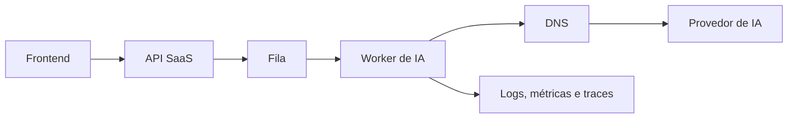

# Runbook — Diagnóstico de rede entre API, worker e provedor de IA

- **Status:** draft
- **Data:** 2026-06-23
- **Escopo:** comunicação API → fila → worker → provedor externo de IA.

## Diagrama



## Matriz de sintomas

| Sintoma | Hipótese | Evidência inicial | Mitigação |
|---|---|---|---|
| DNS falha | resolver indisponível ou nome errado | `dig host` no ambiente do worker | fallback/resolver correto |
| Timeout de conexão | rota/firewall/egress | `curl -v` e trace de rede | liberar egress ou reduzir dependência |
| TLS inválido | CA, SNI ou relógio | `openssl s_client` | corrigir cadeia/tempo, nunca desabilitar validação |
| 429 | quota/rate limit | status e headers | backoff com jitter e reprocessamento |
| 503 | instabilidade externa | taxa por provedor | circuit breaker e fila de retry |

## Comandos mínimos

```bash
dig api.provedor-ia.example
curl -v https://api.provedor-ia.example/health
ss -tnp
```

## Política operacional

- Timeout de conexão: 2s inicialmente.
- Timeout de resposta: 20s para embeddings pequenos, revisável por métrica.
- Retry: máximo 3 tentativas, backoff exponencial com jitter, apenas para operações idempotentes ou com chave de idempotência.
- Logs: registrar host lógico, duração, status, tentativa e trace ID; nunca registrar token.
- Segurança: validar TLS, restringir egress e armazenar tokens em secret manager.
